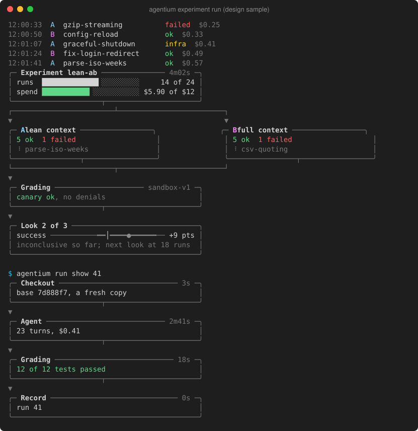
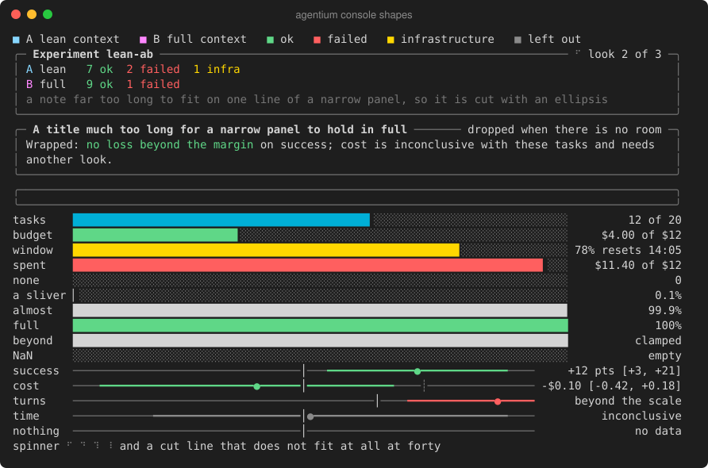

# A designed console: a live dashboard and visual reports

- Date: 2026-10-03
- Status: Planned. The user asked (2026-10-03), showing an animated terminal dashboard ("agent stack": coloured panels, bars, a streaming log): "Is it possible to do beautification of our app in this way? Like some sandbox work, analyze etc". The user's choices:
  - a **live dashboard** for a running experiment, redrawn in place;
  - **and a log format too** ("But also should be dashboard and just log format"): a styled, append-only log, chosen per call or once;
  - all four screen groups: `experiment run`, `experiment report`, `run show`, and `start` / `experiment plan` / `pool status`.
- Scope: Agentium's human console output only. It follows the [no web UI decision](../decisions/2026-09-30-console-instead-of-web-ui.md): the console is the product's face.

## Outcome
- **A running experiment** shows **each arm's current task as a row of step boxes joined by dotted lines**, redrawn in place on a terminal. The user settled this on 2026-10-03 after a series of previews: one panel was "too difficult to understand… too many strange words"; tracks were rejected for "keep boxes but with lines"; then "dot line like on the screenshot and dot that move"; then "remove arrow at the end, just dot line".
  - **Header:** the question in plain words, coloured by arm ("BASELINE vs TRIMMED · does trimmed save money?"). Under it, one line with the money spent against the budget, the share of the Claude plan used and each arm's progress ("baseline 11/16 · trimmed 10/16"). A legend explains the sandbox once ("sandbox: no internet, your secrets hidden").
  - **Each arm:** its name and current task, then four step boxes: **fresh copy → Claude works → hidden tests → result**.
    - **Done steps:** a green border, and ✓ with the time.
    - **The current step:** the arm's colour, with a spinner and its time.
    - **Later steps:** grey.
    - **The result box:** ✓ passed or ✗ failed. The run then drops into the log, and the arm's next task starts again at fresh copy.
  - **The sandbox:** Claude works and hidden tests each sit inside a dashed purple outline labelled "sandbox". It reads "docker" in the container mode to come; with `--grader host` there is no outline around grading, and a warning instead.
  - **Connectors:** thin grey dotted lines (`╌`) between the boxes, with no arrowheads; they never change. When a step finishes, **a dot in the arm's colour travels along the dotted line** to the next box, passing through the sandbox's edge.
  - **The answer so far:** a green box in plain words ("about the same cost (+4%) · not sure yet · next check after 16 tasks"). At the end it becomes "the answer", e.g. "no clear difference in cost · stopped early · more tasks would not help".
  - **Plain words throughout:** no "look", "futility", "interval", "window", "arm A/B" or bracketed numbers on this screen. Those stay in `experiment report` and `--json`.
  - **Colours** (from the user's screenshot): baseline blue, trimmed orange, the sandbox purple, done and the answer green, failures red, everything else grey.
  - **Animation:** up to about 10 frames a second; the dot slides between boxes, spinners turn, and bars and counts update as runs finish. Nothing blinks.
  - **Previews** (`AGENTIUM_TERM_DEMO`-style frames turned into an animated SVG) are shown to the user before any of this merges.
  - The agreed preview, animated:  (sample data).
- **The connected-box flow** for one run (`run show`) uses the same boxes, dotted lines and sandbox outlines: fresh copy → Claude works → hidden tests → result, with each step's time and cost. A one-time "how this experiment works" flow when an experiment is created is optional, to be previewed first.
- **The log sits inside the frame while it runs**, as the approved preview has it: a fixed area of the last 4 runs' results under the answer, blank until filled, so the frame never jumps (the user, 2026-10-03: "it spams and goes somewhere, like last 3-4 only"). Nothing prints above the region during the run: the checks, calibrations, pauses, retries and warnings show as one status line in the frame. **When the screen closes**, on every exit path (the end, an error, a panic, Ctrl-C), the region clears and the full log goes to the scrollback once: what was printed before the first run, the question, every run's line and the answer.
- **Reports, run details and previews** get the same visual language: boxes with coloured borders, dotted connectors, plain words, colour per arm and per outcome. Interval bars stay in `experiment report`, explained in words beside them.
- **Two views for a running experiment.** The dashboard is the default on a terminal. `--view log` (or `AGENTIUM_VIEW=log`, set once) gives the styled, append-only log instead:
  - a coloured line per run;
  - a small box at each check of the answer and at the end;
  - nothing redrawn, so it suits SSH, tmux, recordings and slow terminals.

  `--view dashboard` forces the dashboard (`AGENTIUM_VIEW=dashboard`). Off a terminal, both give today's plain text.
- **Nothing changes for machines.** With `--json`, a pipe, `NO_COLOR`, `TERM=dumb` or a narrow terminal (below 60 columns), output is today's plain text, byte for byte. Golden tests keep pinning it.

## Design rules
- **Restraint over decoration** (the user, 2026-10-03: "keep all UI not so overloaded"):
  - each box holds only what matters now, two or three lines; details belong in the log view, `run show` or the report;
  - no number shown twice, and no label that restates the obvious;
  - breathing room: gaps between side-by-side boxes, a blank line between flow rows only where it helps, no nested boxes;
  - at most one spinner per box; nothing blinks and no colour animates;
  - wide terminals get more space, not more content (boxes keep their width; the flow is at most 100 columns).
- **One small palette, used everywhere** (no rainbow):
  - arm A and arm B each get their own colour;
  - outcomes: ok is green, failed red, infrastructure yellow, left out dim;
  - verdicts: improved and no loss green, regressed red, inconclusive dim;
  - money and the window turn yellow, then red, as they near their limit;
  - borders, connectors, spinners and secondary text in one muted grey.
- **Box drawing and block characters,** falling back to ASCII when the locale is not UTF-8. Widths are measured in display cells and fitted to the terminal; a resize redraws.
- **Live region rules:**
  - at most about 10 redraws a second, and only on change or for the spinner;
  - every write goes through one renderer (no interleaving);
  - the cursor and screen are restored on exit, on an error and on an interrupt (SIGINT is handled as today, and the region is cleared first);
  - a non-terminal never sees an escape.
- **No new modules:** the standard library, plus the existing `syscall` terminal size code in `internal/term`.

## Work
Step 1 comes first; steps 2–5 build on it and can run two at a time.
- [x] **1. `internal/term` primitives.**
  - Panels (boxes with titles), bars (with partial blocks), interval bars, the palette, a spinner and width fitting.
  - A **live region** renderer (bottom-anchored, throttled, resize-aware, safe on exit).
  - Capability detection: terminal, colour, UTF-8 and width.
  - Tests: golden renders at several widths, ASCII fallback, plain fallback, the renderer's cleanup on cancel, and no escapes on a pipe.
  - Risk: medium (concurrency in the renderer).
  - Done: `Capabilities`/`DetectCapabilities`, `Role` and `Style.Paint` (8, 256 and 24-bit), `Width` in cells (wide characters), `Truncate`/`Pad`/`Wrap`/`Sanitize`, `Shapes` (`Panel`, `Bar`, `IntervalBar`, `Legend`, `Spinner`), `Display`/`NewDisplay`. Goldens in `internal/term/testdata` (40, 80 and 120 columns; color, ASCII, plain); the live region is driven through a fake terminal (`vt_test.go`) and on a real pseudo-terminal. No screen uses them yet.
  - Added for the data-flow layout: `Row` (boxes side by side, equal or weighted widths, padded to the tallest, stacked when too narrow), connectors at the boxes' middles (an arrow, a split, a merge, ┬/┴ on the borders, ASCII `+ | - v`) and `Flow` (rows top to bottom, joined). Goldens at 40, 60, 80 and 120 columns.
  - Review fixes (PR #133): `Frame` is `func(width, height, tick int)`, so a frame compacts to the rows it gets instead of being cut; `Panel.MaxWidth` and `Flow.MaxWidth` default to `MaxContentWidth` (100); `Accent` is gone (it clashed with arm A); `Log` waits while `MaxPending` (1000) lines are queued; every styled line in the region ends with a reset and `Close` resets and shows the cursor; a failing `Over` stream drops only its own lines; `Sanitize` also drops raw C1 bytes, invalid UTF-8 and bidirectional overrides.
  - Limits:
    - A stacked row (three boxes under about 66 columns, two under about 43) reads top to bottom: arrows enter its first box and leave its last, so the split and merge lose their meaning there.
    - Shrinking the terminal's height leaves a stale copy of the region in the scrollback; a narrowing resize assumes the terminal reflows lines (Terminal.app, iTerm2, kitty), and on one that does not (xterm) it can erase a few log lines from the screen.
    - A frame must not call the display's methods (`Flush`, or a `Log` that waits for room, would deadlock); a killed process (SIGKILL, `os.Exit` without `Close`) leaves the cursor hidden.
    - The plain display passes text through as today; screens `Sanitize` text from outside Agentium.
  - Samples (`AGENTIUM_TERM_DEMO`, then `ansi2svg.py`): a still of the live view, the log above the experiment flow, and `run show` as a chain; and every shape.

    

    
- [x] **2. `experiment run`** (and `start --yes`): the live dashboard (the step boxes, dotted connectors and moving dot above, in a `Display` frame) and the log view, both fed by the executor's events, with `--view dashboard|log` and `AGENTIUM_VIEW`. The plain output when not on a terminal stays as today. Include calibration, usage pauses, `--wait`, budget stops, looks, judge pairs and sandbox lines. Risk: medium.
  - Done:
    - **Events:** a run's steps reach the observer as `Event{Kind: "step"}` (`run.StepPreparing`, `StepAgent`, `StepGrading`, `StepJudging`, the words `Env.Step` already sent), only when an observer takes events. `Result.Passed` carries the grade, and `Observer.Finish` gets the `Summary`. Records, JSON and the plain lines are unchanged.
    - **The screens** (`internal/cli`): `runstate.go` keeps the state behind a lock and copies it for each frame; `rundash.go` draws the dashboard on a `term.Canvas`; `runview.go` holds the words; `runscreen.go` wires either view to the observer.
    - **Compaction:** the dashboard drops the legend, then draws boxes on one line, then each arm on one line. On a terminal narrower than 74 columns it uses 10-cell boxes with short names.
    - **The log:** a fixed area of the last 4 runs' results in the frame. What is printed during the run (checks, calibrations, revalidation) is held and shown as the status line ("getting ready · …" before the first run). Pauses, retries, warnings and the pair judge's comparisons also take the status line, under the header (a comparison or a warning for 10 s, a retry until its run starts, a pause until it ends), in place of how the runs are run ("2 at a time · each run up to $3 and 20 min · Ctrl-C stops; run again to go on", which replaces the plain lines' "Running up to …").
    - **Notices that must not wait:** a run recovered from a dead Agentium, and a start file that cannot be read, print above the region at once, so a kill before the end loses neither.
    - **The end:** the screen closes on every exit path, an error, a panic or Ctrl-C included. The region clears, and the held lines, the question, every run's line and the answer go to the scrollback once.
    - **Steps are opt-in:** only an observer that asks for them gets steps (`Observer.Steps`). The plain and JSON observers never do, so a stalled terminal cannot hold a run at a step boundary.
    - **Plain words:** the answer's wording is one table (`answerWords`, tested case by case). A fixed design's answer is read from its analysis once every run is done.
    - **Palette:** the arms are blue (75) and orange (215), the sandbox purple (141) and green 114. At 8 colors, warnings and infrastructure failures are magenta (arm B is yellow there) and the sandbox blue. The term color goldens were rewritten for it.
    - **Choosing the view:** `chooseView` gives the plain lines off a terminal, on `TERM=dumb`, below 60 columns, with `--json`, and with `NO_COLOR` unless a view is asked for.
  - Samples, recorded from the real code with the test stand-in for Claude Code (2 s a run, no paid runs): the dashboard, animated ([`console-run-dashboard.svg`](../../docs/images/console-run-dashboard.svg)) and still ([`console-run-dashboard-still.svg`](../../docs/images/console-run-dashboard-still.svg)), and the log view ([`console-run-log.svg`](../../docs/images/console-run-log.svg)), with `scripts/readme_images/frames2svg.py`.
  - Limits:
    - The summary printed after the run (`WriteProgress`, shared with `experiment show`) still says "Looks" and "look 1 of 3": that is step 3's and step 5's.
    - A run that is never graded leaves its tests box at "–".
    - With concurrency above 2, each arm shows its latest run.
    - Before the first run, the status line shows only the latest line printed. The checks' warnings reach the screen at the end, in the scrollback.
- [ ] **3. `experiment report`:**
  - a verdict panel with interval bars;
  - per-arm panels;
  - a per-task grid (each task's outcome per arm, coloured);
  - notes as dim lines.

  Markdown and JSON are unchanged. Risk: low.
- [ ] **4. `run show`:** the run as a vertical data-flow chain (`Shapes.Flow`, one box per row): checkout → agent (its sandbox, tools, turns, cost) → grading (host or `sandbox-v1`, canary, denials) → record, each box two lines at most, with its time on the right. Risk: low.
- [ ] **5. `start`, `experiment plan` and `pool status`:** the looks and spend as bars; the pool's health (valid, weak, flaky, invalid, awaiting review, retired) as bars. Risk: low.
- [ ] **6. Pictures:** re-record the README and gallery images, plus an animated SVG of the live dashboard for the README, with `scripts/readme_images`. Risk: low.

## Acceptance
1. On a terminal, each screen above shows its designed form; `experiment run` in both views. A real console sample (a screenshot or a recorded SVG) of each is in this plan.
2. Every existing golden and plain-output test passes unchanged. `--json` and piped output are byte for byte as before.
3. The live region never corrupts output:
   - a test drives it with a fake terminal (a pty or a writer capturing escapes) through updates, a resize and a cancel;
   - it leaves the screen clean;
   - nothing is written to a non-terminal except plain lines.
4. `NO_COLOR`, `TERM=dumb`, a non-UTF-8 locale and a 40-column terminal each give a readable result.
5. Docs: the guide's output section describes both views, `--view` and `AGENTIUM_VIEW`, and plain output (`NO_COLOR` or piping).

## Boundaries
- No new modules, no paid runs, no change to what is computed: only how it is shown.
- Isolation step 3 (#131) and `agentium clean` are in flight. Steps 2–5 touch `internal/cli` and `internal/report`. Merge main before each and keep to the presentation files.

## Verification
`python3 scripts/harness.py check changed`; the term and screen tests; a review per step; real console samples.

## Metrics
- Agent: <client> / <exact model id> / <effort>
- Elapsed: <minutes>m
- Check-fix loops: <n>
- User corrections: <n>
- Review: <verdict>
