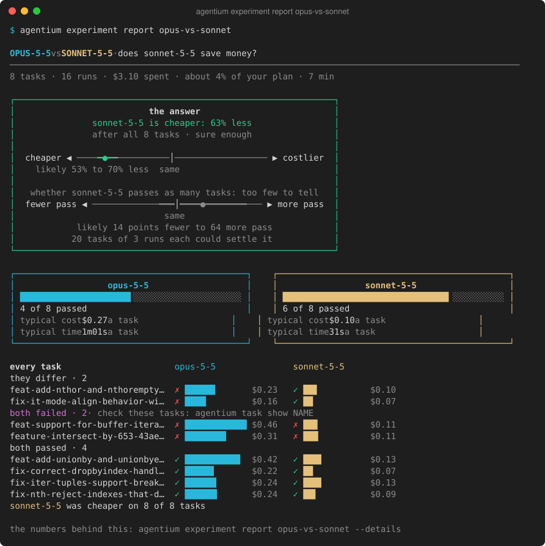
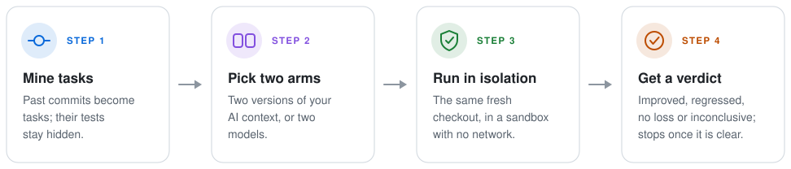
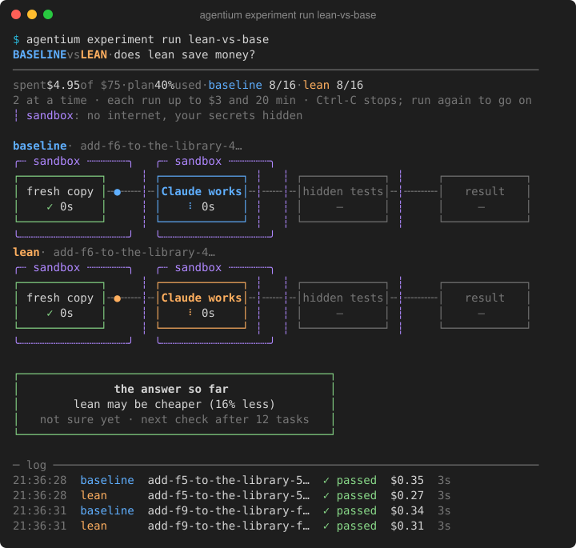
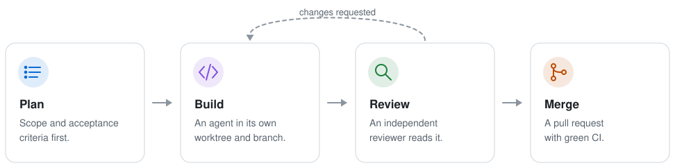

<div align="center">

# Agentium

**Find out what a change to your AI coding setup really does, on your own code.**

[](https://github.com/pigeaca/Agentium/actions/workflows/ci.yml)   [](LICENSE)

</div>

Agentium is a personal tool. I build it for my own work with Claude Code on macOS and share it as it is. You are welcome to use it, read it and open issues, but I may not get to them, and it may change without notice.

It runs coding agents on tasks taken from **your own repository** and tells you the answer in plain words, with honest statistics behind it. It answers these questions well:

- **Is a cheaper model good enough for this repository?** Two models on the same tasks from your history: cost, passes and time.
- **Does a big change to my context pay off?** A rewritten `CLAUDE.md`, or a new set of rules or skills, against today's.
- **Do the agents follow my rules?** Rule checks count the runs that ran the tests, or left a folder alone (`agentium check add`).

What it cannot see is a small trim. Cutting a few thousand tokens from a context moves cost by a few percent, and an experiment of 16 runs sees 25% or more; the preview says so before anything is spent.



*The report of a real experiment on [samber/lo](https://github.com/samber/lo): Opus 5.5 against Sonnet 5.5 on 8 tasks from its history. The answer is in the box, with where the true difference likely lies; below it come each model's passes and every task, grouped by whether the two differed.*

## What it has answered so far

| Question | Answer | What it took |
|---|---|---|
| Opus 5.5 or Sonnet 5.5, on [samber/lo](https://github.com/samber/lo)? | Sonnet cost 63% less a task (95%: 53% to 70% less). Passes: 4 of 8 against 6 of 8, too few to tell. | 16 runs; the first clear answer came 65 minutes and $3.34 after setup · [report](docs/examples/model-ab-report.md) |
| A full or a minimal context, on this repository? | Not sure. Every run passed, and the cost difference (+5%, 95%: −11% to +25%) was too small for 16 runs to see. | 16 runs, $19.65 · [report](docs/examples/context-ab-16-report.md) |

The other [stored reports](docs/examples/) were checks of the tool itself.

## How it works



- **Your tasks, not a benchmark.** A past commit becomes a task: Claude gets the code from before it, and the commit's own tests become hidden tests.
- **Two versions, side by side.** Your current AI context against a changed one (`CLAUDE.md`, rules, skills), or one model against another.
- **Fair and locked in.** Every run starts from the same fresh copy. Claude and the hidden tests each run in a sandbox: no internet, your secrets hidden.
- **A plain answer.** "trimmed is cheaper: 18% less", "about the same", or "not sure yet". It checks after 8, 12 and 16 tasks and stops as soon as the answer is clear.



*A running experiment, in the default quiet view: progress, spend, what runs now, the answer so far and the last results. (This recording graded on the host, so it carries a warning line; with the sandbox working, the line is gone.) It draws nothing that moves; `--view flow` gives step boxes and `--view log` a plain log. [See it running](docs/images/console-run-dashboard.svg). More screens are in the [gallery](docs/gallery.md).*

## Quick start

You need Go 1.27.1 with a C compiler, Git, [Claude Code](https://claude.com/claude-code) signed in (or `ANTHROPIC_API_KEY`), and your project's own build tool (Go, Maven, Gradle, Cargo or Python).

```sh
go install github.com/pigeaca/agentium/cmd/agentium@latest   # the latest release, once one exists
agentium version
cd /path/to/your/repo
agentium start
```

`start` never writes to your repository. It finds up to 16 tasks in your history, checks them, and shows what an experiment would cost, and whether an experiment of that size can answer. Then it stops: **nothing paid runs until you say so** (`agentium start --yes`, or `agentium experiment run NAME`).

> [!WARNING]
> Running an experiment starts real Claude Code runs. They cost money or use your Claude plan's limits; the preview shows the most it can spend first.

Before tasks are used, read them once for hints that give the answer away: `agentium task show NAME`, then `agentium task edit NAME --reviewed`.

Releases and what each version means are on the [releases page](https://github.com/pigeaca/Agentium/releases); the [policy](.agents/rules/releases.md) is SemVer for the commands, flags, `--json` keys and data folder. From a clone, `go install ./cmd/agentium` builds the working tree.

## Known limits

- macOS first: sandboxed grading needs `sandbox-exec`; Linux has no sandbox yet, and the container mode is parked.
- Experiments run Claude Code only. Codex runs one at a time (`run once --agent codex`, a preview; [guide](docs/guide.md#advanced-flags)); Codex experiments come later.
- The judge features (judge reports, pairs, graded tasks without tests) are experimental and unvalidated.
- No TypeScript yet: Go, Maven, Gradle, Cargo and Python.
- A grade can leave data for later grades through `/mp-` POSIX semaphores and the macOS unified log. This is accepted for the first sandbox version; containers will close it.

## Everyday commands

| Command | What it does |
|---|---|
| `agentium start` | From a repository to a ready experiment, with its cost shown first |
| `agentium experiment new NAME --b trimmed` | Compare your context with a saved version called `trimmed` |
| `agentium experiment new NAME --b claude-opus-5-5` | Compare two models on the same tasks |
| `agentium experiment run NAME` | Run it, with the quiet live screen above (`--view flow` for step boxes, `--view log` for a plain log) |
| `agentium experiment report NAME` | The answer and the details per task |
| `agentium context snapshot NAME` | Save the current context as a version to compare |
| `agentium task add NAME --ticket-file FILE --base REF --solution REF` | A task from a ticket; when its fix has no tests, the judge grades it (unvalidated, reported apart) |
| `agentium task list` | Each task with its last runs and what it tells you: it separates setups, always passes, never passed |
| `agentium task draft NAME` | A clearer task text from the commit, its tests and its fix; one paid Claude call, and the draft waits for your review |
| `agentium check add NAME --ran "go test"` | Count the runs that followed a rule of yours, in every report |
| `agentium pool update` | Find new tasks in your history and keep the old ones fresh |
| `agentium clean` | Show the space unused caches take; `--yes` frees it |

Everything else is in the [guide](docs/guide.md), and more screens are in the [gallery](docs/gallery.md).

## Safety

- **Claude is locked in.** It works in a fresh copy of your code, without the hidden tests or the answer. Its commands have no internet, and your keychain, SSH keys, cloud and Git credentials and other runs are out of its reach.
- **The tests are locked in too.** On macOS, the hidden tests run in their own sandbox by default, and every leftover process is stopped afterwards.
- **Your repository is never written.** Nothing paid runs without your consent, and Agentium starts nothing in the background: it only runs when you, a hook or an AI calls it.
- **Not yet:** other people's repositories. A container mode through Docker is parked for now.

## Development

Agentium is built by AI coding agents under shared rules in [`.agents/`](.agents/README.md): every change is planned, built in its own worktree, reviewed independently and merged with green CI.



```sh
python3 scripts/harness.py help
python3 scripts/harness.py hooks                               # once per clone: enable the pre-commit guard
python3 scripts/harness.py worktree new claude/feat/<topic>
python3 scripts/harness.py check changed
```

See the [harness reference](docs/harness.md) and [agent setup](.agents/reference/agent-setup.md). Read [CONTRIBUTING](.github/CONTRIBUTING.md) first, and report vulnerabilities privately as the [security policy](.github/SECURITY.md) describes.

## License

[Apache 2.0](LICENSE)
