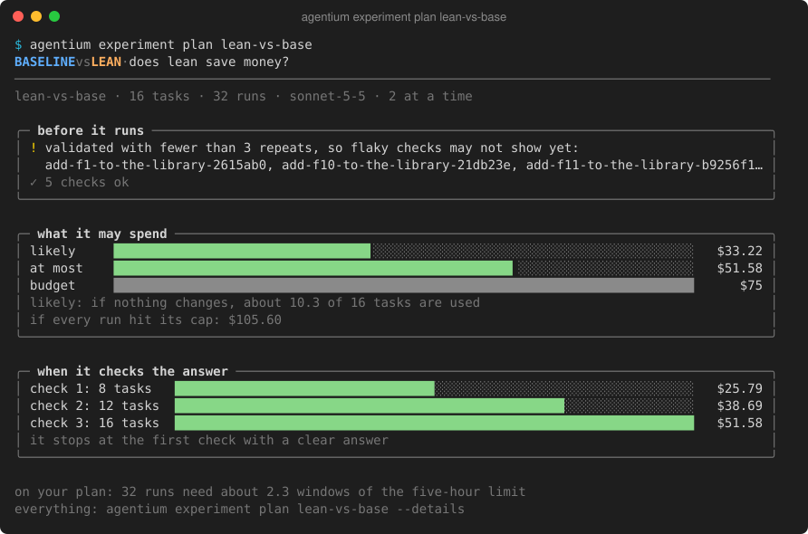
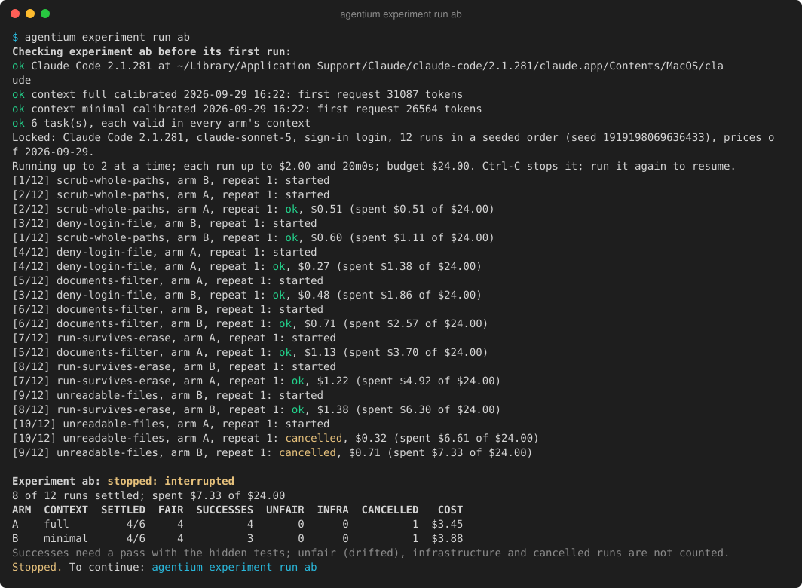
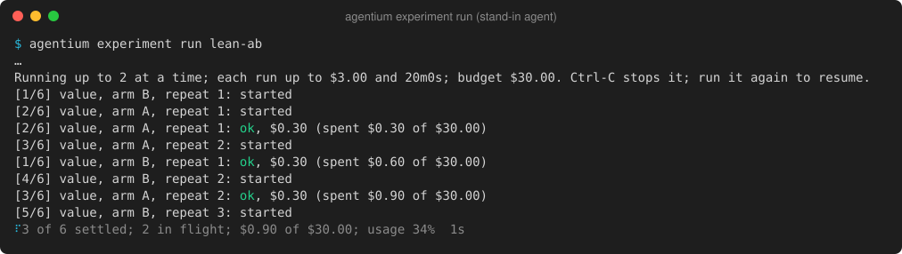
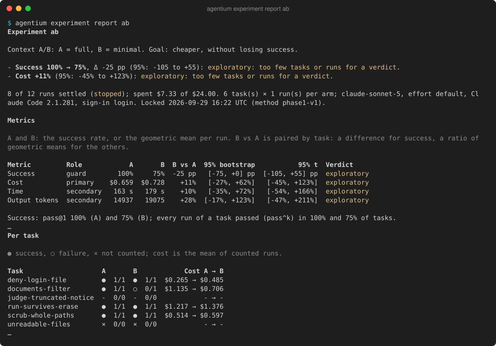
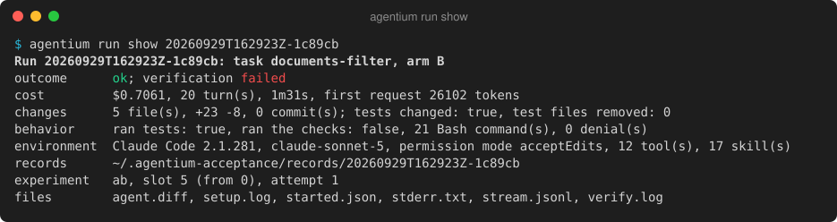

<div align="center">

# Agentium

**A local-first lab that measures what really makes AI coding agents better on your code.**

[](https://github.com/pigeaca/Agentium/actions/workflows/ci.yml)   [](LICENSE)

</div>

Agentium runs coding agents such as Claude Code (Codex comes later) on tasks from your own repository. It measures how the agent, the model or your project's AI context (`AGENTS.md`, `CLAUDE.md`, rules, skills) changes correctness, cost and speed, and it reports the results with honest statistics.

- **Your tasks, not a benchmark.** A past commit becomes a task: its parent is the starting point, and its test changes become hidden tests. You can also write tasks by hand.
- **Context versions as experiment arms.** Snapshot `CLAUDE.md`, rules and skills, change them, and compare the versions head to head.
- **Fair, isolated runs.** Every run starts from a fresh checkout, and its commands run in a sandbox without network. It can't see the hidden tests, the solution, other runs or your credentials.
- **Plain verdicts.** Paired runs with repeats give one of four verdicts: improved, regressed, no loss beyond the margin, or inconclusive. Each comes with its intervals and honesty notes.

> [!NOTE]
> Agentium is early. Phase 1, context A/B for Claude Code from the command line, is done; Phase 2 makes the console output clearer and adds Codex and agent comparison; no web UI is planned. See the [roadmap](.agents/ROADMAP.md) and the [feasibility study](docs/research/2026-09-27-ai-development-lab.md).

## Requirements

- Go 1.27.1 and a C compiler (SQLite is built with cgo)
- Git
- [Claude Code](https://claude.com/claude-code), signed in. `ANTHROPIC_API_KEY` or a token file in `AGENTIUM_CLAUDE_TOKEN_FILE` works too.

## Quick start

```sh
go install ./cmd/agentium          # from a clone of this repository; puts agentium in your Go bin folder
agentium init /path/to/your/repo   # registers it; Agentium never writes to your repository
cd /path/to/your/repo
```

**1. Version your context**

```sh
agentium context show                              # what Claude Code loads at start, and on demand
agentium context snapshot baseline                 # save the committed context (HEAD) as a version
# edit CLAUDE.md, rules or skills, then:
agentium context snapshot trimmed --working-tree   # --include-linked adds linked docs
agentium context diff baseline trimmed --patch
```

**2. Turn past commits into tasks**

```sh
agentium task import --commit <sha>                # base: its parent; hidden tests: its test-file changes
agentium task edit <name> --reviewed               # once the instruction doesn't give the solution away (--accept-gaps: hidden tests need texts or names nothing states)
agentium task validate <name> --snapshot trimmed   # tests fail on the base and pass with the reference, in each arm
agentium task validate <name> --repeat 3           # run every stage 3 times: a task whose runs disagree is flaky, and experiments reject it
agentium task validate <name> --weak-tests          # which parts of the reference the hidden tests do not need (a warning, not a gate; a later validate without the flag drops the list)
```

**3. Run and compare**

> [!WARNING]
> These commands start real Claude Code runs. They cost money, or use your plan's limits.

```sh
agentium run calibrate --snapshot trimmed     # short checks: sandbox, large outputs, context size, tools
agentium run once <name> --snapshot trimmed   # one run, graded with the hidden tests
agentium experiment new lean --b trimmed      # an A/B: each task's own context against trimmed, on a sample of valid tasks
agentium experiment plan lean                 # runs, estimated cost, detectable effects; what is missing
agentium experiment run lean                  # locks it, then runs interleaved pairs within the budget; resumable; pauses before your plan's usage limit (--wait waits for the reset)
agentium experiment show lean                 # the lock and the progress per arm
agentium experiment report lean               # verdicts, intervals, per-task results (--markdown for a pull request, --json for everything)
```

Data lives in `~/.agentium`; set `AGENTIUM_HOME` to use another folder. Output is styled only on a terminal: `NO_COLOR=1` turns color off, and `FORCE_COLOR=1` keeps it through a pipe (for `less -R`).

## Example results

This is real output from Phase 1's acceptance runs: Claude Code 2.1.281 with claude-sonnet-5, on tasks taken from this repository. The pictures show it as today's `agentium` prints it in a 120-column terminal. Paths into the home folder are shortened to `~`, and `…` marks lines left out. The experiment compared today's docs (`full`) with a minimal version (`minimal`). It was stopped after 4 complete pairs to fit one usage window, so every verdict is "exploratory": the report says the data is too thin instead of naming a winner.

**1. Plan it:** what it costs and what it can detect, before anything runs.



**2. Run it:** pairs of runs, interleaved, within the budget. It was stopped here with Ctrl-C, and `experiment run ab` would resume it. The lines are the ones recorded during the run, in today's colors; the summary under them is today's `experiment show ab`.



While runs go, a status line under the events shows the progress and redraws in place. This animation is a short run with a stand-in agent (Agentium's test double for Claude Code), at its real speed:



**3. Report it:** verdicts in words, then the metrics with both intervals, noise, context and cost per arm, behavior (tests run, files changed, denials), per-task results and notes. On a terminal it looks like this; piped, with `--out FILE` or with `--markdown`, it is Markdown you can paste into a pull request, like the [full report](docs/examples/context-ab-report.md) (`--json` for everything).



**4. Look at one run:** the minimal-docs run that failed its hidden tests (`--diff` and `--log` show the agent's changes and the grading output).



The minimal docs cut Claude Code's first request by about 4.6k tokens, but cost did not fall, and one task failed. With four pairs the intervals are far too wide to call either a result, and the report says so in words.

The [A/A report](docs/examples/aa-report.md) is the sanity check: the same context in both arms. It reported no difference (cost −6%, 95%: −31% to +26%), and every run passed.

A larger A/B, 8 tasks × 1 run per arm ([report](docs/examples/context-ab-16-report.md)), found the same: every run passed in both arms, and cost was inconclusive (+5%, 95%: −11% to +25%), with about 55 tasks needed to settle it.

## Development

Agentium is built by AI coding agents (Claude Code and Codex) under shared rules in [`.agents/`](.agents/README.md):

- every task gets a plan with acceptance criteria, and its own worktree;
- a pre-commit guard checks each commit, and an independent reviewer reads each change;
- work lands as a pull request with green CI.

A standard-library Python harness is the single entrypoint:

```sh
python3 scripts/harness.py help
python3 scripts/harness.py hooks                               # once per clone: enable the pre-commit guard
python3 scripts/harness.py worktree new claude/feat/<topic>
python3 scripts/harness.py check changed
```

See the [harness reference](docs/harness.md) and [agent setup](.agents/reference/agent-setup.md).

## Contributing

Read [CONTRIBUTING](.github/CONTRIBUTING.md) first. Report vulnerabilities privately, as the [security policy](.github/SECURITY.md) describes.

## License

[Apache 2.0](LICENSE)
