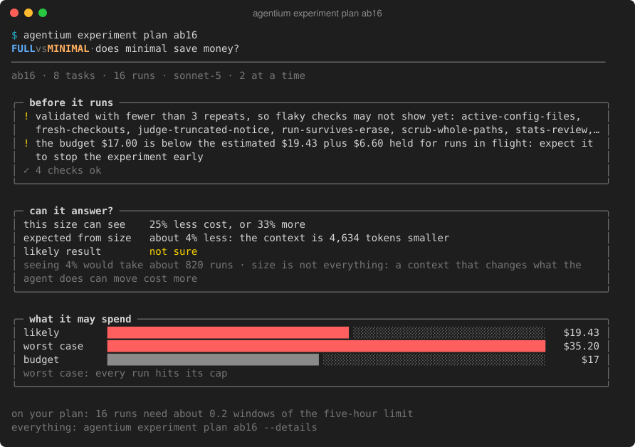
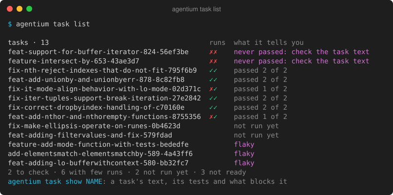

# Gallery

Real console output from Agentium. Back to the [README](../README.md); commands are in the [guide](guide.md).

This is real output, printed by `agentium` built from `main` at d444006 on 2026-10-05, in a 120-column terminal unless a picture says otherwise (the report and the task list: 100 columns; the report's test scenes and the run views: 80). Paths into the home folder are shortened to `~`, and `…` marks lines left out. Where the data comes from:
- **`start` and `experiment plan`** (the first preview): a small fixture repository (a shell library with 16 commits, each adding a function and its test) and the test stand-in for Claude Code, so no run was paid for; the plan is of a seq-v1 experiment on its 16 mined tasks, `lean-vs-base`. The temporary folders and the stand-in's path are written as `~/…`. The second preview, `ab16`, is the real 16-run context A/B of Phase 1's acceptance runs (2026-09-30), planned again from a copy of its data folder; nothing ran.
- **`pool update --dry-run`:** a fresh clone of [Masterminds/semver](https://github.com/Masterminds/semver), free runs that stop before any agent run (Claude Code 2.1.285), recorded on 2026-10-03 and unchanged since: the pool reads the last 270 days, so older commits are counted as outside it.
- **The run views** (the quiet view, the step boxes, the log): a real `experiment run` of the fixture with the stand-in agent, no paid runs. The quiet view and its animation were recorded on 2026-10-05 on a machine whose account cannot read the unified log, so the sandbox grader reported itself unavailable and the run graded on the host (`--grader host`): the picture carries the host grader's warning line, which a machine with the sandbox working does not show. The step boxes and the log view were recorded on 2026-10-03.
- **The report and the task list:** the real model A/B on [samber/lo](https://github.com/samber/lo), 8 mined tasks × 1 run per arm, Claude Code 2.1.285, 2026-10-02: `experiment report opus-vs-sonnet` and `task list` from a copy of its data folder. The other report pictures are the report's test scenes (fixture tasks, not a real experiment), redone on 2026-10-05.
- **`run show`:** recorded on 2026-10-04 from the fixture with the stand-in and the sandbox grader.
- **The `ab` experiment** (the Markdown report): Phase 1's acceptance runs, 2026-09-29.
- **The Judge section:** the `judge-check` experiment, 2026-10-01 (Claude Code 2.1.285).

**1. Start it:** one command from a repository folder registers it, saves its context, mines and validates tasks, creates an experiment and prints its preview. `--accept-mined` accepts the instructions it mined without your review (see `agentium start -h`); it stops before any run, which would cost money.

**2. Look at the candidates:** `pool update --dry-run` ranks tasks from the git history, explains each score and lists what it set aside, without importing anything.

**3. Preview it:** `experiment plan` says what is missing, whether an experiment of this size can answer ("this size can see 19% less cost, or 24% more"), what it may spend as bars against the budget and when it checks the answer, before anything runs (`--details` for the sizes and the detectable effects).

For a context experiment, the panel also says what the contexts' size alone should change. Here the 16-run context A/B (`ab16`, the real one) would see a cost change of 25% or more, and the 4,634 tokens the minimal context saves are worth about 4%: it says "likely result: not sure" before anything is spent.

**4. Run it:** the quiet view, the default on a terminal: progress, spend (and the plan's share), a line for each run in flight, the answer so far with each version's passes and the next check, and the last 3 results; nothing moves. Recorded from a real `experiment run` with a stand-in agent (Agentium's test double for Claude Code), at its real pace:

`--view flow` draws step boxes instead ([picture](images/console-run-flow.svg)): each version's current task moves through fresh copy, Claude works and hidden tests to the result. `--view log` is a plain, append-only log: a line per run and a small box at each check of the answer.

**5. Report it:** the answer in a green box, in words and on a scale that shows where the true difference likely lies; the other side of the question (passes) the same way; each version's passes, typical cost and time; and every task in groups (where the versions differ, where both failed, where both passed) with each version's cost as a bar. `--details` prints every number: the metrics with both intervals, noise, context use, behavior, per-task results and notes. This is the real model A/B, on a terminal:

Piped, with `--out FILE` or with `--markdown`, the report is Markdown you can paste into a pull request, like the [full report](examples/context-ab-report.md) (`--json` for everything). The `ab` experiment's, recorded from Phase 1's acceptance runs (2026-09-29, Claude Code 2.1.281 with claude-sonnet-5, today's docs against a minimal version, stopped after 4 complete pairs, so every verdict is "exploratory"):

**6. Look at the tasks:** `task list` shows each task with its last graded runs (✓ and ✗) and what it tells you. In the model A/B's pool, two tasks never passed with either model (check the text before asking more of them), six have too few runs to say, two have not run and three are not ready (flaky). It is the table to read before choosing tasks for the next experiment.

**7. Read the judge:** with `--judge`, the report adds a Judge section. In `judge-check` it called one passing run "partly" fixed, with its reason, for you to check by hand; the tests still decide.

**8. Look at one run:** the run as a chain: a fresh copy, Claude works and the hidden tests (both in a sandbox, dashed purple), the result (`--details` prints every line; `--diff` and `--log` show the agent's changes and the grading output).

In the `ab` experiment the minimal docs cut Claude Code's first request by about 4.6k tokens, but cost did not fall, and one task failed. With four pairs the intervals are far too wide to call either a result, and the report says so in words.

The [A/A report](examples/aa-report.md) is the sanity check: the same context in both arms. It reported no difference (cost −6%, 95%: −31% to +26%), and every run passed.

A larger A/B, 8 tasks × 1 run per arm ([report](examples/context-ab-16-report.md)), found the same: every run passed in both arms, and cost was inconclusive (+5%, 95%: −11% to +25%), with about 55 tasks needed to settle it.

The first decisive verdict came from a model A/B on [samber/lo](https://github.com/samber/lo), 8 mined tasks × 1 run per arm ([report](examples/model-ab-report.md)). Sonnet 5.5 cost 63% less than Opus 5.5 per run (95%: −70% to −53%), and the whole experiment cost $3.10. Success (75% against 50%) was exploratory at that size; the report's picture is step 5.
