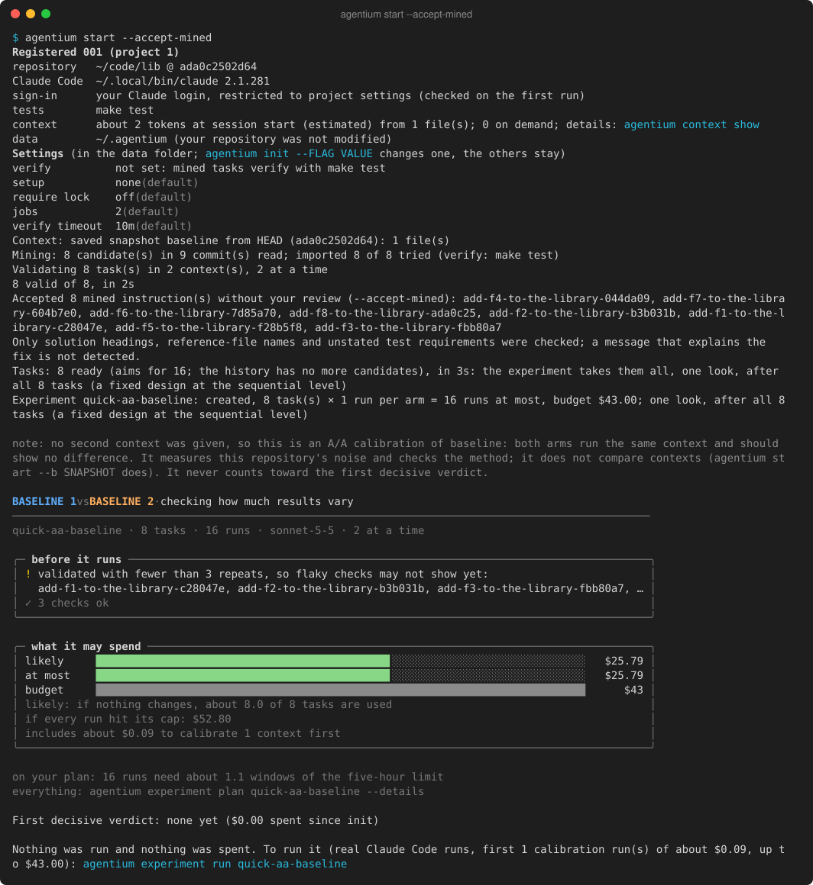
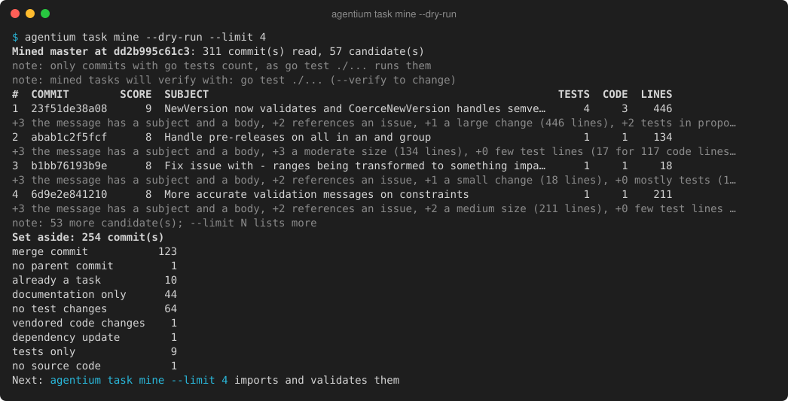
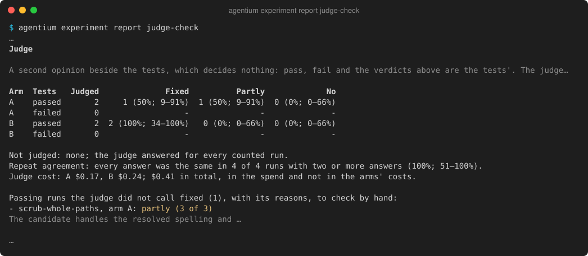
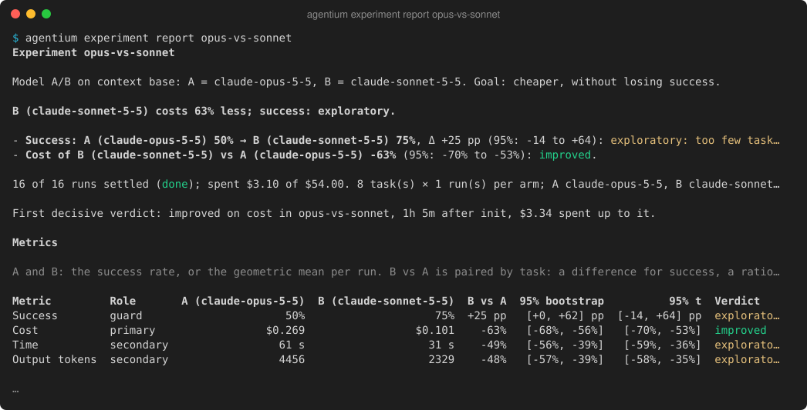

# Gallery

Real console output from Agentium. Back to the [README](../README.md); commands are in the [guide](guide.md).

This is real output, printed by today's `agentium` (built from `main` at b6df097 on 2026-10-02) in a 120-column terminal; the pictures were redone from stored data on that date. Paths into the home folder are shortened to `~`, and `…` marks lines left out. Where the data comes from:
- **`start` and `pool update --dry-run`:** a fresh clone of [Masterminds/semver](https://github.com/Masterminds/semver), free runs that stop before any agent run (Claude Code 2.1.285). The candidates picture was redone on 2026-10-03 with the build that made `pool update` the way to mine, on a new data folder: the pool reads the last 270 days, so older commits are counted as outside it.
- **The `ab` experiment** (plan, run, report, one run): Phase 1's acceptance runs on 2026-09-29, Claude Code 2.1.281 with claude-sonnet-5, on tasks taken from this repository. It compared today's docs (`full`) with a minimal version (`minimal`) and was stopped after 4 complete pairs to fit one usage window, so every verdict is "exploratory": the report says the data is too thin instead of naming a winner. The event lines of the run were recorded then; everything else is re-printed from the stored data.
- **The Judge section:** the `judge-check` experiment, 2026-10-01 (Claude Code 2.1.285).
- **The decisive verdict:** the model A/B on samber/lo, 2026-10-02 (Claude Code 2.1.285).

**1. Start it:** one command from a repository folder registers it, saves its context, mines and validates tasks, creates an experiment and prints its preview. `--accept-mined` accepts the instructions it mined without your review (see `agentium start -h`); it stops before any run, which would cost money.

**2. Look at the candidates:** `pool update --dry-run` ranks tasks from the git history, explains each score and lists what it set aside, without importing anything.

**3. Plan it:** what it costs and what it can detect, before anything runs.

**4. Run it:** pairs of runs, interleaved, within the budget. It was stopped here with Ctrl-C, and `experiment run ab` would resume it. The lines are the ones recorded during the run, in today's colors; the summary under them is today's `experiment show ab`.

While runs go, a status line under the events shows the progress and redraws in place. This animation is a short run with a stand-in agent (Agentium's test double for Claude Code), at its real speed:

**5. Report it:** verdicts in words, then the metrics with both intervals, noise, context and cost per arm, what the runs used of their context (files read on demand, project skills, subagents), behavior (tests run, files changed, denials), per-task results and notes. On a terminal it looks like this; piped, with `--out FILE` or with `--markdown`, it is Markdown you can paste into a pull request, like the [full report](examples/context-ab-report.md) (`--json` for everything).

**6. Read the judge:** with `--judge`, the report adds a Judge section. In `judge-check` it called one passing run "partly" fixed, with its reason, for you to check by hand; the tests still decide.

**7. Look at one run:** the minimal-docs run that failed its hidden tests (`--diff` and `--log` show the agent's changes and the grading output).

The minimal docs cut Claude Code's first request by about 4.6k tokens, but cost did not fall, and one task failed. With four pairs the intervals are far too wide to call either a result, and the report says so in words.

The [A/A report](examples/aa-report.md) is the sanity check: the same context in both arms. It reported no difference (cost −6%, 95%: −31% to +26%), and every run passed.

A larger A/B, 8 tasks × 1 run per arm ([report](examples/context-ab-16-report.md)), found the same: every run passed in both arms, and cost was inconclusive (+5%, 95%: −11% to +25%), with about 55 tasks needed to settle it.

The first decisive verdict came from a model A/B on [samber/lo](https://github.com/samber/lo), 8 mined tasks × 1 run per arm ([report](examples/model-ab-report.md)). Sonnet 5.5 cost 63% less than Opus 5.5 per run (95%: −70% to −53%), and the whole experiment cost $3.10. Success (75% against 50%) was exploratory at that size. The report's headline and first table, with the plain verdict "improved" and the time and spend up to it:

