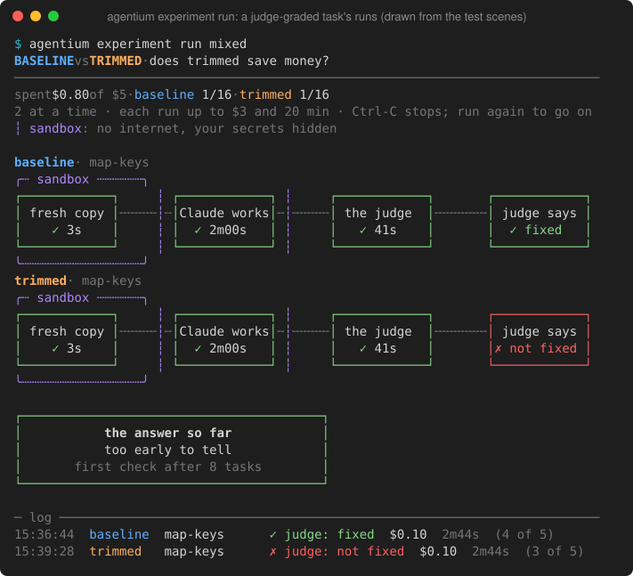
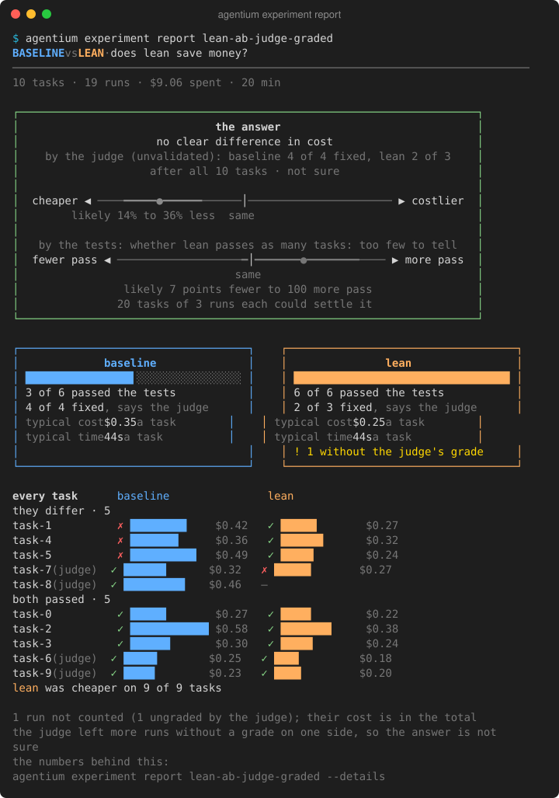
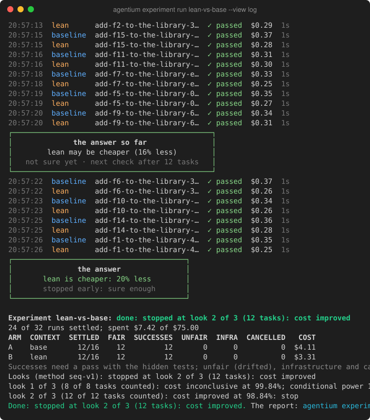
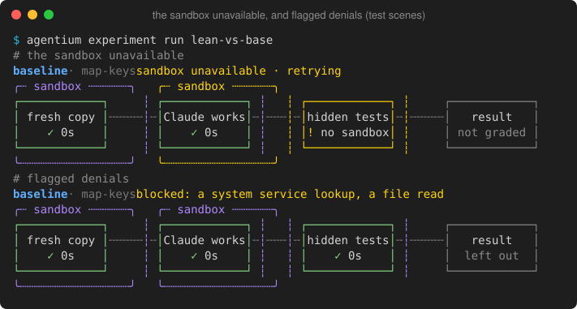
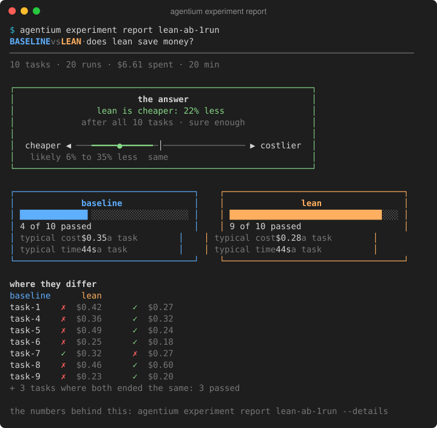

# Guide

The full manual flow. For a first run, use `agentium start` from the [README](../README.md) quick start; this guide covers each step by hand, and the details behind it.

## Contents

- [Registering a repository](#registering-a-repository) and [project settings](#project-settings)
- [Versioning context](#versioning-context) and [context lint](#context-lint)
- [Turning commits into tasks](#turning-commits-into-tasks), [drafts of a task's text](#drafts-of-a-tasks-text), [tasks from tickets](#tasks-from-tickets-graded-by-the-judge) and [the task pool](#the-task-pool)
- [Build tools and offline dependencies](#build-tools-and-offline-dependencies) and [sandboxed grading](#sandboxed-grading)
- [Running and comparing](#running-and-comparing) and [rule checks](#rule-checks)
- [Experiment templates](#experiment-templates)
- [The judge](#the-judge-second-opinion)
- [Scripting and automation](#scripting-and-automation)
- [Data folder and environment](#data-folder-and-environment)
- [Advanced flags](#advanced-flags), and [renamed and removed](#renamed-and-removed) flags and commands

## Requirements in detail

- Go 1.27.1 and a C compiler (SQLite is built with cgo); Git.
- Your project's own build tool, on the machine that runs Agentium: Go, Maven or Gradle (`mvnw` and `gradlew` preferred; Java and Kotlin, with a JDK) or Cargo; for Python, `python3` (a `python3.N` matching `requires-python` when there is one) and, when the project has `uv.lock`, `uv`. Go, Maven, Cargo and Python are proven in real runs; Gradle too, except worker-daemon tools such as Checkstyle and PMD (see [build tools](#build-tools-and-offline-dependencies)).
- [Claude Code](https://claude.com/claude-code), signed in. `ANTHROPIC_API_KEY` or a token file in `AGENTIUM_CLAUDE_TOKEN_FILE` works too.

## What `start` does

`agentium start` never writes to your repository and makes no paid run on its own. It skips steps already done, so run it again to resume:

- registers the repository (`init`) and, if the project has no snapshot, saves the committed context as `baseline` (arm A);
- mines and validates tasks until 16 are ready; when the history has no more candidates, 8 or more will do (the cost floor), with fewer looks;
- creates the experiment `quick-...`, a cost experiment (method `seq-v1`, below) on those tasks x 1 run per arm: an A/A calibration of your context, or with `--b SNAPSHOT` a comparison of the context with that snapshot;
- prints the preview: the looks, the maximum and expected spend, and what is missing;
- stops there. `--yes` (or answering `y` on a terminal) runs the experiment, within its budget (`--budget USD` raises it). The run first calibrates each context that lacks a calibration (a short paid run, about $0.1 to $0.2, counted in the budget and shown in the preview).

Mined instructions need your review for solution leaks (`agentium task show NAME`, then `agentium task edit NAME --reviewed`, or `agentium task rm NAME` for one you will not accept), so a first `start` stops there and lists them. `start --accept-mined` accepts the tasks it mined without your review: it checks only solution headings, reference-file names and unstated test requirements, so an instruction that explains the fix passes. The default A/A calibration never counts toward the first decisive verdict.

`start` and `experiment report` also show how long it took, and what was spent, to your first decisive verdict (improved, regressed or no loss; inconclusive does not count), from finished experiments only.

## Registering a repository

```sh
agentium init /path/to/your/repo   # registers it and prints its settings; Agentium never writes to your repository
cd /path/to/your/repo
```

### Project settings

Set once, kept in the data folder (never in the repository, so no commit can change them), and printed by every `agentium init`. Running `init` again changes only the settings it is given.

```sh
agentium init --verify "make test" --setup "make assets"   # the commands mined and imported tasks verify and set up with
agentium init --jobs 1 --verify-timeout 20m                 # validate one task at a time; each command may take 20 minutes
agentium init --require-lock                                # mining sets aside Python commits whose base pins no dependencies
agentium init --verify "" --require-lock=false              # back to the detected commands; mine unpinned bases again
```

| Setting | Default | Used by |
|---|---|---|
| `--verify CMD`... | mined tasks: the build tools' test command (below); imported and hand-made ones: every test command `init` found | `pool update`, `start`, `task import`, `task add` (whose own `--verify` wins) |
| `--setup CMD`... | none | the same |
| `--require-lock[=false]` | off | `pool update`, `start` |
| `--jobs N` | 2 | `pool update`, `start`, `task validate --all` |
| `--verify-timeout DURATION` | 10m | the same, and the experiment `start` creates |
| `--module PATH` | none: the repository's root | the module of a monorepo that tasks mined, added or imported from now on run in (each task keeps the module it was made with): build tools are detected in its folder, and setup, verification and the offline warm-up run there. `pool update` and `start` mine only commits whose tests and code are all in the module (documents may change anywhere; a commit with tests elsewhere is set aside, and `task import` refuses it), with a watermark of the module's own. The agent starts in the module's folder, as you would, and may still change the whole checkout; its context is what Claude Code loads there: the instruction files and `.claude` folders of the root, of the module and of the folders between (`context show` and `context snapshot` use the module too). Only the loading of `CLAUDE.md` files up the tree is documented by Claude Code; which `.claude` folders above the starting folder it loads is unverified, and Agentium shows, snapshots and applies arms to all of them. With no build file at the root, `init` lists the candidate modules |
| `--allow-local-binding[=false]` | off | agent runs on a Gradle project ([build tools](#build-tools-and-offline-dependencies)) |

A project with no settings behaves as it did before settings existed. A command's own flag (in [advanced flags](#advanced-flags)) wins for that call only. `init --json` has them under `"settings"`.

## Versioning context

```sh
agentium context show                              # what Claude Code loads at start, and on demand
agentium context snapshot baseline                 # save the committed context (HEAD) as a version
# edit CLAUDE.md, rules or skills, then:
agentium context snapshot trimmed --working-tree   # --include PATH adds a document the context links to
agentium context diff baseline trimmed --patch
```

### Context lint

Free: `agentium context lint [--ref REF]` checks the working tree (or a commit) and reports the size change against your latest snapshot, broken `@` imports, `AGENTS.md` files that Codex would cut off (it reads only the first 32 KiB of the chain from the root down) and the warnings `show` gives. It runs no agent and exits 0 even when it finds problems. To see it after every edit of a context file in Claude Code, run `agentium context lint --print-hook` and merge the printed `PostToolUse` hook into your own `~/.claude/settings.json` (Agentium never writes your settings, and its runs load project settings only, so the hook never fires inside them).

## Turning commits into tasks

```sh
agentium pool update --dry-run                     # commits that would make good tasks (tests and code changed, small, a clear message), with scores, and why others don't
agentium pool update --limit 10                    # import the best 10 and validate them: base: the parent; hidden tests: the test-file changes
agentium task edit <name> --reviewed               # once the instruction doesn't give the solution away (--accept-gaps: hidden tests need texts or names nothing states)
agentium task edit <name> --instruction @fix.md    # replace the instruction with a file's text (@@ starts a text with @)
agentium task validate --all --snapshot trimmed    # tests fail on the base and pass with the reference, in each arm (the jobs setting at a time)
agentium task import --commit <sha>                # one commit by hand (mining skips commits that are already tasks)
agentium task validate <name> --repeat 3           # run every stage 3 times: a task whose runs disagree is flaky, and experiments reject it
agentium task validate <name> --weak-tests          # which parts of the reference the hidden tests do not need (a warning, not a gate; a later validate without the flag drops the list)
```

`start` mines on its own for a first experiment; `pool update` ([the task pool](#the-task-pool)) keeps tasks fresh after that.

Validation also warns when a verify command's `go test` filter keeps one of the task's own hidden tests from running: a `-skip` pattern that matches a test function the solution adds or changes in a hidden `_test.go` file, or a `-run` pattern that does not. Grading would never run that test. It is a warning, not a gate: the status stays as the stages found it, and `task show` repeats it.

### Drafts of a task's text

A mined task's text is its commit message. When that is one terse line and the hidden tests need names it never gives, the agent fails for a reason that has nothing to do with the setup you compare. A draft restates the problem and the names the tests need, without the fix:

```sh
agentium task draft <name>                   # one paid call; prints the draft, or why it was refused
agentium task show <name>                    # the instruction, then the draft beside it
agentium task edit <name> --accept-draft     # the draft becomes the instruction; the task then awaits your review
agentium task edit <name> --reviewed         # once you have read it (or --accept-draft --reviewed in one step)
```

- **One call, paid.** Claude Code on `claude-sonnet-5-5` at its default effort, without tools, capped at $0.50; Claude Code checks the cap after the turn, so the preview says "at most $0.65". The call reads, as data, the commit message (the task's instruction), the reference change to code files and the hidden tests' change, each cut at a stated size (20,000 characters for the message, 40,000 for each change) with their closing tags neutralised. It is asked for the problem, the behavior wanted and every name and exact text the tests need, never how to implement it and never text copied from the reference.
- **Consent.** The command you type on a terminal is your consent, as for `run once`. With `--json`, or off a terminal (a script, a hook, an agent), it needs `--yes`; without it, nothing runs or is spent and it exits 1. It takes the data folder's run lock, so a draft never runs beside an experiment, and waits for it or refuses as `run once` does.
- **Two checks, both must pass.** The [unstated-requirements check](#turning-commits-into-tasks) must find nothing in the draft, and the giveaway check no name only the reference has: a name the reference's code declares, that no base file of its language contains, no hidden test file contains (strings and comments included) and the task's current instruction does not state (the agent is told those already), and that the draft spells exactly (Go, Java, Kotlin, Rust, Python, TypeScript and JavaScript; names under 4 characters are skipped). A refused draft is printed with what each check found, nothing is stored (an earlier draft stays), and the command exits 1.
- **Never by itself.** A draft is stored beside the instruction with its time and model. Only `task edit --accept-draft` puts it in place (and clears it); the task then awaits your review even if it was reviewed before, unless `--reviewed` is given, which applies the usual gate (`--accept-gaps`). `--accept-draft` and `--instruction` exclude each other. The task remembers that its text came from a draft (`task show` says so, and its `--json` `review` is `draft`) until you write the instruction yourself, and neither `start --accept-mined` nor `pool update --accept-mined` ever marks such a text reviewed, nor touches a stored draft.
- **Spend.** Each call's cost counts as soon as it returns, before the checks, whatever it brought: a refusal, a malformed reply, the cap, a timeout. `task show` prints the task's drafting spend. The call writes its reply to its own folder in the data folder (`artifacts/drafts`), which goes once the cost is stored; if Agentium stops in between, the next command that starts paid work in this data folder (`task draft`, `run once`, `experiment run`, `start --yes`) counts that cost (once), says so, and removes the folder. While such a call may still be running, those commands refuse to start and name its folder; when the process group number was reused by another program (it started at another time), the call is settled as ended. A leftover whose call never finished has an unknown spend, at most $0.65, and is said to; a leftover's draft is never taken: run the command again. Each write is bound to the task the call started for: if that task was removed meanwhile (even if a new task took its name), the call's cost is kept with the draft calls, no task is charged, and nothing is stored.

### Tasks from tickets, graded by the judge

```sh
agentium task add shop-42 --base <sha> --solution <sha> --ticket-file SHOP-42.json   # a Jira export (JSON) or a Markdown ticket
agentium task add cart --base <sha> --solution <sha> --instruction @cart.md --judge-graded   # your own text, a fix without tests
agentium task validate shop-42                                                       # the instruction says something, the fix changes code; nothing runs
agentium experiment new tickets --b trimmed --task shop-42 --task value --goal better   # named: a sample never draws a judge-graded task
```

`--ticket-file` reads one exported ticket (Jira's JSON export of an issue, or Markdown with a title, a description and an "Acceptance criteria" section) into the instruction, keeps its key as the source (`ticket SHOP-42`) and asks for a review: read it with `task show`, then `task edit NAME --reviewed`. When the ticket's fix (`--solution`, usually the merged pull request) changes no test files, there are no hidden tests, and the task is **judge-graded**; `--judge-graded` does the same for an instruction you wrote.

A judge-graded task's run is graded by the [judge](#the-judge-second-opinion) instead of tests: it compares the run's change with the reference fix's code (never tests: there are none) and asks 5 times; a majority of "yes" passes the run, a majority of "partly" or "no" fails it, and a run that changed no code fails. Its verification commands do not run. The agent's run always stands, and is never run again for its grade:
- **A judge error leaves the grade pending.** A usage limit, a call that cannot be made, timeouts or error results, an interrupt, or Agentium stopping while the judge grades leave the run counted nowhere until it is graded. An experiment grades it again from the run's stored change: before its runs on a resume (crash recovery included), after its runs, and before each `seq-v1` look, which waits for every grade of its stages. Answers already given stand: only the calls without one are asked again. A usage limit pauses the experiment; three attempts that end in other errors leave the run without a grade. `run once` makes one attempt, within the cost it named, and keeps the grade pending.
- **A refusal, a reply still malformed when asked again, or a tie is final.** The run is left without a grade: not counted, never a fail, never tried again. The report counts these runs per arm. When the arms differ (one has some and the other none, or they differ by more than 1 or 10% of the counted pairs, as for runs the sandbox left out), the verdicts those runs would feed (cost, time, output tokens) are demoted to inconclusive, and the report says what counting them would give.

Each grading attempt may spend up to $5.00 (5 calls at $0.50, each asked again after a malformed reply), which `run once` names before it starts and an experiment's budget holds back for every such run in flight (and for each attempt to grade again); the preview estimates $0.065 a call. The grading prompt is its own (protocol version 2): it cuts the instruction at 20,000 characters (as the diffs at 40,000; `task validate` warns about a longer one), tells the judge that everything inside its tags is data to judge and not instructions, and neutralises closing tags in what it quotes, so the agent's change cannot end its own section.

In an experiment:
- **Only when named.** `--task NAME` takes a judge-graded task; a sampled experiment and `start` never draw one. A test-graded and a judge-graded task can share an experiment.
- **Two successes, kept apart.** Success is the tests' alone, over the test-graded tasks; "the judge says fixed" is the judge-graded tasks', its own metric. No verdict is ever computed over both, each is held to success's floor over its own tasks alone, and "the judge says fixed" never has a verdict: it is exploratory. `experiment new` warns when the test-graded tasks are fewer than success's floor.
- **Cost counts both.** Cost, time and output tokens count every graded run of both kinds (a run without a grade, pending or final, is out of every metric); a `seq-v1` look counts the tasks with graded cost in both arms, and stops on a cost verdict as before.
- **Not in the north star.** The north star leaves out every experiment with judge-graded tasks, whatever its verdict, until the judge's paid real check validates it, and says so: `First decisive verdict: …; left out: tickets (it has judge-graded tasks, whose grades are unvalidated until the judge's paid real check)`; the JSON's `north_star.left_out` lists them, each with `experiment` and `why`.
- **Labelled wherever a pass shows.** `run once` and `run show` print `judge: fixed (4 of 5)` (or `grade pending (…)`, `not graded (…)`) instead of the verification's result; `run list` shows `yes (judge)`, `no (judge)`, `pending (judge)` or `ungraded (judge)`; the dashboard's grading box reads "the judge" and its result "judge says ✓ fixed" (`✓ judge: fixed` on one line), and its log line `✓ judge: fixed … (4 of 5)`; the report marks the tasks `(judge)` in its per-task grids, names both successes ("by the tests: …", "by the judge (unvalidated): …"), adds a "The judge says fixed" row and line, and a note.





Its limits: the judge's grading without tests was **inconclusive** in the [pilot](research/2026-10-01-judge-pilot-results.md) (it called every failing run with a change not fixed, but also flagged passing runs of one task), so these grades are unvalidated. The judge reads the agent's diff, which the agent wrote: a change can try to persuade it, and only its majority and its reference stand against that. A diff longer than 40,000 characters is cut, and `task validate` warns when a reference is.

### The task pool

Free, no agent runs: `agentium pool update` is one pass over the pool.

```sh
agentium pool update --dry-run    # what a pass would mine, validate, re-validate and retire; writes nothing
agentium pool update              # mine the commits since the last pass, validate them, re-validate stale tasks, retire dead ones
agentium pool status              # valid (and weak), flaky, invalid, awaiting review, retired, as bars; the last pass; the oldest valid base
```

- **Mining** reads the default branch's commits since the last pass, oldest first (at most 2,000 per pass; the next pass reads on), within 270 days by committer date, and imports up to `--limit` (default 10) as tasks that need your review, validated the jobs setting at a time (default 2), with the project's verify and setup settings. Commits that are tasks already, and rebased or cherry-picked copies of any task's change (same patch ID), are skipped; so is a mined task's commit once you remove the task. A candidate whose base would retire within 30 days is not imported. `--dry-run` lists the candidates with their scores and the commits set aside, per reason (the scan's reasons, those older than the window, and candidates whose base is too old or whose change was mined before). Commits a pass set aside are not read again by later passes; `--since DATE` ([advanced flags](#advanced-flags)) re-reads them.
- **Re-validation:** a task is stale when its last validation is more than 30 days old, was made with other versions of the build tools (Go, Maven, the JDK, Cargo, rustc; `task validate` records them), or is flaky and untried for 7 days (it is tried with `--repeat 3`). It keeps its arms and repeats, and its weak-tests result. A task that a locked, unfinished experiment uses is kept as it is ("kept for experiment X"). While an experiment is running, re-validations are skipped with a warning (they would slow its runs; the pass checks again before each group of tasks it starts, and stops when one starts), and new tasks are validated one at a time. Without a detected test command, a pass mines nothing and says so, but still re-validates and retires.
- **Retirement** is a flag with a reason, never a delete: a base 270 or more days old, or a hidden test or reference file the solution has that is gone from the default branch. Retired tasks leave new experiments; locked ones keep them.
- **Review:** mined tasks wait for `agentium task edit NAME --reviewed`. `--accept-mined` accepts only the valid tasks this pass imported, after `start --accept-mined`'s checks; it accepts nothing when the pool's state file was unreadable.

### Build tools and offline dependencies

Mined tasks verify with your build tool's test command (`go test ./...`, `./mvnw -q test` or `mvn -q test`, `./gradlew test` or `gradle test`, `cargo test`); `agentium init --verify` changes it. Dependencies for the agent's offline builds are fetched by a run's setup, once per base commit and tool set, into the `deps` folder of your data folder (`~/.agentium`, or `AGENTIUM_HOME`). Build files are detected at the repository root, or in the module's folder with `agentium init --module PATH`: a Maven or Cargo build in another subfolder is not detected, so its agent gets no offline dependencies, and your caches stay denied to it. Go is the exception for the agent's environment: its variables (`GOFLAGS`, the run's own `GOCACHE`, your allowlisted `GO*` settings) reach the agent wherever the base commit has a `go.mod`, a `go.work` or any `.go` file (a module in a subfolder, a script run with `go run`), or when no build tool is detected at all; a project with another build tool and no Go file (a Python package, say) gets none of them. Mined tasks still verify with `go test ./...` only when `go.mod` is at the root (or in the module, with `--module`). Plugins that fetch their own tools when a task runs (Spotless, say) are not warmed, so those tasks fail offline in the agent's sandbox. Gradle tools that run in a separate worker process (Checkstyle, PMD) also fail in the agent's sandbox: Claude Code's sandbox allows only IPv4 localhost connections, and Gradle starts those workers without the option that keeps Java on IPv4. Grading is unaffected (in the grading sandbox, Gradle binds its daemons to `::1`); only the agent can't run them itself. Gradle's file-lock service needs the sandbox's local binding, which lets the agent bind any local port and reach localhost services (outbound network to other hosts stays blocked): agent runs on a Gradle project refuse to start until you run `agentium init --allow-local-binding` (`--allow-local-binding=false` turns it off). Validation fetches those dependencies first, as a run's setup does, into the same `deps` folder (a task's runs then find them ready), so it runs the verification with what grading uses: for a Python project, the same venv, interpreter and `PYTHONPATH`. When another run or validation is fetching for the same project, it waits up to 15 minutes, then validates without the fetched dependencies and says so in a note. Validation builds and runs tests on your machine, two tasks at a time by default: more than one assumes your tests can run side by side (no fixed ports, shared `/tmp` paths or databases), so set `agentium init --jobs 1` if they cannot.

For a Python project the venv holds its dependencies only, never the project: tests import the project from the checkout (`PYTHONPATH`, and `MYPYPATH` for mypy). So that tests asking `importlib.metadata` for the project's version still work, each base also gets the project's metadata, made at warm-up by `uv build --wheel` (or the venv's `pip wheel`) and reduced to its headers: a read-only `.dist-info` with nothing but `METADATA`, after the checkout on `PYTHONPATH`, for the agent, validation and grading alike. A checkout holds one commit, so a version computed from git (setuptools-scm, hatch-vcs) reads `0.0.0`, with a note; console scripts and entry points of the project itself are not there. Hypothesis keeps its database in the run's cache, or for validation and grading in one per checkout in the data folder, never in the checkout. A base without a lock file (no `uv.lock`, no fully pinned requirement files) is resolved at warm-up with today's versions, with a note, and its own tests can fail for that alone (a newer mypy, say). The project setting `agentium init --require-lock` makes `pool update` and `start` set such Python commits aside ("no lock file"). `pool update` scans only commits newer than its last pass, so commits a pass set aside under the setting are not revisited by a later pass without it; `pool update --since DATE` re-reads them. A project's known-flaky tests fail validation at random: leave them out of the verify command (`agentium init --verify "uv run pytest -q --deselect tests/test_x.py::test_flaky"`, say), or validate with `--repeat 3`, which marks a task whose runs disagree as flaky.

### Sandboxed grading

Grading runs the agent's code: its build scripts, `conftest.py` or `build.rs` run with your access unless something stops them. On macOS, Agentium grades in a sandbox of its own by default (`--grader sandbox`, mode `sandbox-v1`); elsewhere it grades on the host as before. `experiment new --grader host` opts an experiment out; `run once` and `task validate` take the same flag (an [advanced flag](#advanced-flags)).

- **What the sandbox allows.** A grade runs its verification commands with `sandbox-exec` under a deny-by-default profile, in a folder of its own in the run's records: the grading copy (`grading/copy`), a build cache cloned from a per-project, per-base seed, and a temp root. It writes only those; it reads everything else on the machine except Agentium's data folder (other runs, hidden tests, the shared caches, the database), your repository, the paths the agent was denied and the credential stores (the keychain among them). It has no network but this machine's. The environment is the agent's (the same JDK, Go, Python and offline dependencies), so a fix that works for the agent works for the grade.
- **Fail closed.** When an experiment locks or resumes, and when a validation command starts, Agentium checks that `sandbox-exec` applies a profile here and that this account's unified log shows the kernel's sandbox denials (a probe's denial must appear): nested inside another sandbox (Agentium started from an agent's shell), or where `log show` hides kernel messages, it refuses sandbox mode with the reason, rather than grade without knowing its denials. Each run checks `sandbox-exec` again before its agent starts; a grade whose denials the log does not show in time keeps its result, with a note. Before each grade a canary proves the profile holds; when it does not, nothing is graded and the run is an infrastructure failure (retried, or left out), never a fail and never a host grade.
- **Denials.** The kernel logs each denial under the grade's own tag; Agentium reads them from the unified log after the grade, leaving out what every grade's tools cause (`/dev/dtracehelper`, bash's `/dev/tty`, the JVM's `hsperfdata`, `configd` and `mDNSResponder`, the analytics lookups of tools such as `security`, the Go toolchain's telemetry counters, and the notification and Spotlight lookups Cargo makes). A message that can be split more than one way (a process name or path forging the kernel's format) counts as a denial the agent's sandbox does not impose. A failed grade with denials the agent's own sandbox does not impose (a Mach lookup such as the keychain's server, POSIX shared memory, a Unix socket, the grader's extra credential stores) cannot be told from a sandbox failure, so it is left out: outcome `infra-sandbox`, not counted, and not tried again (a retry would let an arm re-roll its failures). A passing grade stays a pass. `run show` prints the counts, the report a note; the denials' paths stay in the run's records.
- **The per-arm check.** The report (and `experiment show`, in its own count) counts these exclusions per arm against the pairs counted in both arms. With one run per arm, a task left out in one arm drops out of the paired comparison (with repeats it stays paired on its other runs); the other arm's run still counts in that arm's own rates. Whenever any run was left out, the report says what counting those runs as fails would give. When the arms differ (one has some and the other none, or they differ by more than max(1, 10% of the counted pairs)), the cost and success verdicts are demoted to inconclusive; when they do not, a verdict that counting them as fails would change is demoted too. A `seq-v1` look applies the same check, so it never stops on a verdict the check would demote. Three runs in a row left out this way, on more than one task, stop the experiment, as an outage does: a toolchain the sandbox breaks would otherwise pay for every run.
- **Harmless denials.** Validating a task in the sandbox keeps the flagged denials its reference solution logs while passing: for that task and toolchain they are harmless, so a later grade's denial among them is not flagged (the experiment's lock fixes the set). A hidden-tests stage that failed with such denials is valid when the reference passed with all of them.
- **What dies with a grade.** Every process of the grade's own sandbox is stopped when the grade ends, even one that left its process group with `setsid`, changed folder and closed its files; then the grade's folder is removed (or moved to the data folder's `cache/quarantine` when the grade made it unremovable).
- **One mode per experiment.** The lock records the mode (`sandbox-v1` or `host`); runs, validations and reports name it. A host experiment refuses tasks validated in the sandbox; a sandbox experiment validates tasks validated on the host again in the sandbox when it locks (time, no money); `experiment plan` lists them. Experiments created or locked before modes keep grading on the host, and an older Agentium refuses a sandbox experiment rather than grade it on the host.
- **`--keep`** keeps the grading copy in the run's records as before (`verify/`); the rest of the grade's folder goes.

Known limits:

- On macOS the sandbox's "localhost" is every address of the machine: a grade can listen on your network address and accept connections from the network, and reach any service listening on this machine (a database, a dev server, a local proxy). Other hosts stay unreachable. Container mode (later) closes this; until then the firewall is the guard.
- Tests that need the internet, Docker, a database server, Unix sockets or writes outside the copy (`~/Library/Caches`, dotfiles) fail in the sandbox; validate in the sandbox to find them before an experiment does.
- A grade can leave data where a later process of yours could read it: in `/mp-` POSIX semaphores (Python multiprocessing needs them) and in the unified log. Both need the model to collude with itself across runs. This is accepted for `sandbox-v1`: closing the semaphores would break Python multiprocessing, and closing only the log would leave the other channel open; container mode (later) closes both.
- Each grade builds from a cold cache: the seed holds the build tools' prepared folders, not compiled code.
- Flagged exclusions cost information: an arm whose code trips the sandbox more often loses runs, and then its verdicts are demoted rather than decided. A harmless set fixed from an old validation can hide a flagged denial of the same operation and target after a toolchain change: validate again after one.
- A validation's grading folders lie in the data folder's `artifacts`, where recovery does not look: when Agentium itself is killed during a validation stage, that stage's folder (left read-only) and whatever its grade left running stay until removed by hand (`chmod -R u+w`, then remove it). Cleaning them at the next start would need validations to take the run lock, since another command's validation may be using them.

## Running and comparing

> [!WARNING]
> These commands start real Claude Code runs. They cost money, or use your plan's limits.

```sh
agentium run once <name> --snapshot trimmed   # one run, graded with the hidden tests
agentium experiment new lean --b trimmed      # a cost A/B: each task's own context against trimmed, on up to 16 valid tasks (method seq-v1, below)
agentium experiment plan lean                 # what is missing, what it may spend as bars against the budget, when it checks the answer (--details: runs, estimated cost with calibrations, detectable effects)
agentium experiment run lean                  # calibrates what is not calibrated (short checks: sandbox, large outputs, context size, tools), locks it, then runs interleaved pairs in stages, a look after each, within the budget; resumable; pauses before your plan's usage limit (--wait waits for the reset)
agentium experiment show lean                 # the lock and the progress per arm
agentium experiment report lean               # the answer in plain words (--details for every number, --markdown for a pull request, --json for everything)
```

**What a running experiment shows.** On a terminal, `experiment run` (and `start --yes`) draws a quiet live dashboard, redrawn in place when something changes and once a second for its clock; nothing on it moves or spins. From the top: the question in plain words ("BASELINE vs TRIMMED · does trimmed save money?"); `runs`, a bar with the runs done of all and the time; `spent`, the money against the budget and, with a subscription, your plan's share used; `now`, a line for each run in flight (version, task, step and the time in it) or, between runs, the latest pause, retry or warning; `so far`, the answer so far in words ("about the same cost (+4%) · not sure yet"), each version's passes and the next check; `last`, the last 3 results; and a hint. A grade the sandbox blocked or left out shows in the last results in yellow, with what was blocked in plain words; a judge-graded run says "judge: fixed" with its votes; the host grader's warning stays under the budget. It drops the hint, then the last results, on a short terminal. When the run ends, or stops on an error or Ctrl-C, the dashboard is cleared and the full log stays in the scrollback: what was printed before the first run, every run's line and the answer.

`--view flow` (or `AGENTIUM_VIEW=flow`) draws the earlier default instead, frozen as it was: the money spent and each arm's progress; each arm's current run as four steps (fresh copy, Claude works, hidden tests, result) joined by dotted lines, with a dashed outline around what runs in the sandbox. A box in progress says what it is doing when that can take a while: copying, fetching dependencies (a base's first run may download for minutes), running the setup, starting the sandbox, running the tests, cleaning up. If the grading sandbox cannot start, the row's outline turns yellow and the row says "sandbox unavailable" (the run is not graded, and is tried again). If a grade was left out for denials the agent's own sandbox does not impose, the row says what was blocked in plain words ("blocked: a system service lookup"), never a path, and the run's log line says "left out (sandbox)". A folder a grade's cleanup could not remove, moved to the quarantine (`agentium clean` removes it), gets a line in the status line. Then comes the answer so far ("about the same cost (+4%) · not sure yet · next check after 12 tasks"); and the last 4 runs' results, in a fixed area. A status line under the header says how the runs are run, or the latest pause, retry or warning, and before the first run what is being checked; nothing prints above the dashboard while it runs. The flow view compacts to fit a short terminal, and uses narrower boxes on a terminal narrower than 74 columns. When the run ends, or stops on an error or Ctrl-C, the dashboard is cleared and the full log stays in the scrollback: what was printed before the first run, every run's line and the answer.


`--view log` (or `AGENTIUM_VIEW=log`, set once) prints the same in styled lines instead, nothing redrawn: a line per finished run, and the answer in a small box at each check and at the end. It suits SSH, tmux, recordings and slow terminals. `--view dashboard` (or `AGENTIUM_VIEW=dashboard`) asks for the quiet dashboard, and `--view flow` for the step boxes, even with `NO_COLOR` (without color). Piped, redirected, with `--json`, with `NO_COLOR` (unless a view is asked for), on `TERM=dumb` or below 60 columns, output is the plain lines, byte for byte as before. `experiment report --details`, the Markdown and the JSON keep the exact terms (looks, intervals, levels); the running screens and the report on a terminal say them in words.





**Reading the report.** On a terminal, `experiment report` shows the answer in plain words, in the dashboard's colors:
- **The question,** then the tasks, runs, spend and time it took, and with a subscription sign-in the experiment's share of your plan's five-hour limit ("about 4% of your plan"; left out, with the time before it, when the line does not fit), estimated from the runs' usage readings as `experiment plan` estimates it; absent with an API key.
- **The answer,** in a green box, worded as the dashboard words it ("lean is cheaper: 22% less", "after all 10 tasks · sure enough"; when it is not sure, "not sure yet · about 57 tasks in all could settle it"). A picture on a "cheaper ◀ │ ▶ costlier" scale shows where the true difference likely lies, said in words ("likely 6% to 35% less"), with "same" under the line of no change. Under it, the other side of the question (passes, for a cost question; cost, for a `--goal better` one) gets the same words and picture. With no verdict yet it says "too few to tell", draws its picture in grey and says what could settle it ("about 40 tasks in all could settle it", or else the metric's own floor: "20 tasks of 3 runs each could settle it", the size below which the analysis gives no verdict; for cost in a `--goal better` experiment, which no size settles, "a --goal cheaper experiment could settle it"). In an A/A, the second line is how much the same setup's cost varies from run to run, with no second picture.
- **Each version,** side by side (one under the other below 74 columns): its passes as a bar and a count, its typical cost and time (the geometric means the verdicts use), and runs cut short at their cap, out of time or left out by the sandbox.
- **Every task,** in groups: the tasks the two versions ended differently; the tasks both failed ("check these tasks", with the command that shows one); tasks that ended the same with a mixed result (with repeats); and the tasks both passed (6 rows, then "+ 3 more passed in both"). Each row has each version's runs as ✓ or ✗, its mean cost as a bar on one scale for the whole list, and the cost. A last line says which version was cheaper on more tasks ("lean was cheaper on 8 of 8 tasks"; none in an A/A). Below 70 columns the bars are left out. Tasks whose every run was left out stay a count.
- **What the agents did,** only when the project has [rule checks](#rule-checks): one line per check with a bar per version (in the version's color) and "7 of 8", a muted note for runs that could not be read, and the words "counts of your rule checks, not a verdict". Below 70 columns the bars are left out.
- **The judge's opinion,** with `--judge` or `--judge-pairs`, labelled as an AI's opinion, not a test: how many passing fixes it thinks right per version, and which version's fix the pair judge preferred, by task (below).
- **Notes,** dim, only when they matter: runs not counted, passes that changed the test setup, an unfinished experiment, the sandbox.

**The other screens.** On a terminal, four more commands are pictures in the same style (colors, dotted lines, plain words), and each has the text it had before for a pipe, `NO_COLOR`, `TERM=dumb` or a terminal below 60 columns:
- **`run show ID`** is the run as a chain of boxes, top to bottom: fresh copy, Claude works, hidden tests (or the judge, for a judge-graded task), result. Each box is two lines at most, with its time on the right; the boxes that run in a sandbox have a dashed purple outline. `--details` prints every line (cost, behavior, environment, files); `--diff` and `--log` still follow.
- **`experiment plan NAME`** (and the preview `start` prints) shows whether everything is in place, whether this size can answer the question, what the experiment may spend (the likely spend, the most and the budget as bars) and, for a seq-v1 design, each check of the answer with its spend as a bar. Nothing it says blocks a run. `--details` prints the sizes, the detectable effects, the floors and every note.
  - **Can it answer?** The smallest change this size can see: for a cost question a reduction in cost ("25% less cost, or 33% more": a rise is seen from the same distance on the log scale, which is larger) (a design that checks early is held to its last check's bound, so it needs a larger change than a fixed design of the same size), or points of the pass rate for `--goal better`, counting only test-graded tasks (judge-graded ones never count toward passes). A metric below its floor gets no verdict at any effect, and the panel says so in place of a number ("no answer on passes at this size: it needs 20 tasks of 3 runs each": the default `--goal better` size, 12 tasks of 3 runs, is below it). For a context experiment whose two contexts are calibrated and with at least 3 earlier task runs on the model, it also shows the change expected from the contexts' size alone: the first request writes the difference in tokens to the prompt cache once and each later request reads it, over the cost of a run (4,575 tokens fewer, 38 requests and $1.23 a run is about 4%). When that is below what the size can see it says "likely result: not sure" and how many runs seeing it would take (never fewer than the cost floor's); when it is above, no likely result is promised. Size is not everything: a context that changes what the agent does can move cost more. A model experiment and an A/A show the first line only.
  - **Your plan.** With a subscription sign-in and a current reading of the window, the five-hour limit as a bar, where runs pause (`--usage-limit`), how long ago the reading was taken, by that reading how many more runs fit (use by other sessions since is unseen) and how many limits the experiment needs. Without a current reading, or with an API key, the dim line about the plan stays as it was.
  - **Tasks that cannot separate.** For `--goal better`, "before it runs" names the experiment's tasks that passed every time (4 or more graded runs) and those that never passed (2 or more), as `task list` tags them. They are cautions: they do not change which tasks run, and the experiment is not "not ready" for them.
- **`task list`** shows each task with its last graded runs (up to 8, newest last, as ✓ and ✗; a `+N` counts older ones) and one tag for what the task tells you. Runs of every version count together, from experiments and single runs, graded by tests or by the judge; only the agent's own attempts count (not infrastructure failures). The tags: `separates` (some passed, some failed: it can tell two setups apart), `always passes: too easy` (4 or more runs, all passed), `never passed: check the task text` (2 or more runs, none passed), `passed k of n` (under 4 runs), `not run yet`, or what blocks it from an experiment: not reviewed, unstated requirements, not validated, no solution to check with, flaky, invalid, retired. The first that fits applies. A line counts the tags, and the last line points to `task show NAME`. `task list --details` prints the table of sources, tests and status instead, as every other output does.
- **`pool status`** shows the pool's health as bars (valid, with weak tests, flaky, invalid, awaiting review, retired; states with no tasks are left out), then the last pass and the oldest valid base. Under the bars, a line counts what the tasks tell you (see `task list`).

`--details` shows every number instead (the metrics with both intervals, the looks, the noise, context use, behavior, the per-task table and every note). Piped, redirected, with `--markdown`, `--out` or `--json`, with `NO_COLOR`, on `TERM=dumb` or below 60 columns, the report is what it was: the Markdown, the JSON, or the `--details` text.



Runs use `claude-sonnet-5-5` at the CLI's default effort unless `--model MODEL[:EFFORT]` says otherwise (`experiment new` and `run once`; `--model claude-opus-5-5:high`, say); an experiment keeps the model it was made with. Estimates come only from earlier runs on the same model (and effort), so the first experiments on Sonnet 5.5 fall back to a default task run at list prices, and their default budgets and consent prompts look high until runs on it measure the project.

Each run stops at its cap (`--run-budget`, default $3). Claude Code checks the cap after each turn, so a run can pass it by the turn that crosses it (the `seq-v1` smoke check: $0.507 against $0.50). The budget therefore holds back an allowance beside the cap of every run in flight: 10% of the cap, at least $0.15 on a model whose output costs what Sonnet's does, a floor that scales with the model's output price ($0.30 on Opus 5.5, $0.375 on Opus 5, the dearest price in the table for a model without one). A judge other than the default model and effort holds the same allowance per call. The preview's worst case includes it, and a run's estimate is never above its cap. A capped run records how far it went past its cap; one that passed the allowance gets a warning in the run's progress and in the report.

The report marks runs cut short, capped at their cost cap or turn limit or stopped at the timeout, in the per-task table (`1/1, 1 capped`, and a mean cost of `≥$0.507`) and counts them in a note: such a run counts as it ended, graded and at the cost it reached, which is a lower bound of what it would have cost. That makes an arm cut short more often look cheaper, so a cost verdict that favours it says so in its headline.

### Rule checks

Your context files hold rules for agents: "run the tests before you finish", "do not edit generated files". A rule check counts the runs that followed one of them, per version, in the report:

```
agentium check add ran-go-test --ran "go test"                # a shell command the agent ran contains the text (case kept)
agentium check add touched-tests --changed "**/*_test.go"     # the agent's change touches a file that matches
agentium check add kept-docs --not-changed "docs/**"          # it touches no file that matches
agentium check list
agentium check rm kept-docs
```

Names follow the rule for snapshot names; give exactly one of the three flags, with a value that is not empty. Checks belong to the project and are kept in the data folder, never in your repository. A name that exists already, or one `rm` does not find, is a failure (exit 1); a wrong call is a usage error (exit 2). The three commands take `--json` (`check add` prints `check` with `name`, `kind` (`ran`, `changed` or `not-changed`) and `pattern`; `check list` prints `checks`; `check rm` prints `removed`).

Nothing is recorded while a run is made. When a report is made, each counted run is read again: the commands are the ones its stored transcript shows as run, less the denied ones; the paths are the file headers of its stored change (a rename counts under both names, a deleted file as changed; the glob is the one rule files use: `*` within a folder, `**` across, `?`, `{a,b}`). So experiments that ran before a check existed are counted too. A run whose transcript (for `--ran`) or change (for the others) is missing or unreadable is neither met nor unmet: it is counted as unread. An empty change touches nothing: `--changed` is unmet and `--not-changed` is met.

The counts are over the runs the report's behavior rows count, and they are counts, never a verdict: no statistics, no good or bad. On a terminal the report shows them as "what the agents did"; `--details` and the Markdown report have a "Rule checks" table after the behavior table, one row per check with the rule in words and, per version, "met of counted" (and "n unread" when there are some). `experiment report --json` gains `checks`: `[]` without checks, else per check `name`, `kind`, `pattern` and `arms`, an object by version name of `met`, `counted` and `unread`. A project without checks gets the report it had, apart from that empty list.

### How a cost experiment decides

Cost experiments (`--goal cheaper`, the default) run method `seq-v1`, a group-sequential design: up to 16 tasks x 1 run per arm, in stages, with a look after 8, 12 and 16 tasks (one look after all of them with 8 to 11 tasks, two with 12 to 15).

- **Looks.** A look comes once its stage's runs are settled, retries included, and analyses exactly the tasks of the stages so far. No run of the next stage starts before it. Each look's cost interval is wider than a fixed design's (99.84%, 98.84% and 96.88% at 8, 12 and 16 tasks): together they spend a two-sided 3.5%, O'Brien–Fleming-type, which keeps false differences at or under 5% in the simulations of the [statistics note](research/2026-10-02-wave3-statistics-note.md).
- **Stops.** The experiment stops at the first look with a cost verdict (improved, regressed or equivalent), or for futility, when a verdict by the last look has become unlikely (below 10%); `experiment new --no-futility` turns futility stops off (an [advanced flag](#advanced-flags)).
- **Spend.** `experiment plan` shows each look's runs and spend, the maximum (every stage; the default budget covers it), and the expected spend if nothing changed and at a 20% cut.
- **Stops between looks.** The budget, the usage limit or Ctrl-C keep the last look's verdict; `experiment run` resumes the stage, and its look comes once the stage is settled.
- **Reading it.** The report says where the experiment stopped ("stopped at look 1 of 3") and lists each look with its interval. An early stop overstates the effect's size on average: the true change is likely smaller than the estimate.

Success and time are exploratory in cost experiments. For success verdicts use `--goal better`: 12 tasks x 3 runs per arm, or the tasks `--task` names (method `phase1-v2`, one analysis at 95%); the [advanced flags](#advanced-flags) `--tier confident` (23 x 5) and `--repeats` change the size. Experiments locked before keep the method they were locked under.

## Experiment templates

 `experiment new` reads the template from `--b`, which says what the experiment compares:

| `--b` | Template | Compares |
|---|---|---|
| none | `aa` | one context in both arms (`--a`, default `base`, each task's own context), which must find no difference: it measures the noise |
| a snapshot | `context-ab` | arm A's context (`--a`, default `base`) with the snapshot |
| `MODEL[:EFFORT]` | `model-ab` | two Claude Code profiles on the same tasks and one context (`--context`, default `base`): arm A's (`--a`, default `--model`) with B's |

```sh
agentium experiment new noise                                    # an A/A
agentium experiment new lean --b trimmed                         # a context A/B
agentium experiment new models --b claude-opus-5-5:high          # a model A/B: claude-sonnet-5-5 (--model's default) against Opus 5.5 at high effort
agentium experiment new efforts --a claude-sonnet-5-5:low --b claude-sonnet-5-5:high --context trimmed
```

A model is one Agentium's price table knows (`claude-sonnet-5-5`, `claude-opus-5-5`, a dated ID such as `claude-haiku-4-5-20251001`) or a name shaped like a Claude model ID (`claude-next-9`: a family, then version numbers, optionally a date); an alias such as `sonnet`, or a name such as `claude-rules`, reads as a snapshot's name. `context snapshot` refuses a name that reads as a model; a snapshot made with one before is refused as `--b`, saying it was read as the model: snapshot that context again under another name to compare it. The stored design, `experiment list` and the JSON keep the template's name.

In a model A/B, `--a` and `--b` are `MODEL` or `MODEL:EFFORT` (low, medium, high, xhigh or max; without one, the CLI's default), and `--a` and `--model` both set arm A, so give one of them. The arms must differ in model or effort. The plan estimates each arm from your earlier runs on its model (or from a default run at list prices), flags a model without a list price, and covers both arms in the budget; `--run-budget` caps each run in both arms. Each arm's model needs its own calibration of the context: `experiment run` makes the ones that are missing, once, before the first pair. The preview counts their cost, and a calibration that fails its checks stops the experiment before any task run. Reports of model experiments name each arm by profile (model and effort) in the headlines, the metric tables and the per-task rows, with a one-line verdict such as `B (claude-sonnet-5-5) costs 48% less; success: exploratory`; the noise note says it pools both models.

## The judge (second opinion)

 Tests decide pass and fail. `experiment new ... --judge` also asks an LLM judge about every graded run: does its change do what the task asks, as the task's reference solution does? The judge reads the instruction and both changes' code, never the tests; tasks whose reference solution has no code are skipped. It answers fixed, partly or no, with a one-line reason, and takes the majority of 3 repeats. It runs on `claude-opus-5-5` at high effort; `--judge=MODEL[:EFFORT]` picks another (with the equals sign: `--judge claude-opus-5-5` would read the model as a second NAME).

The report's Judge section shows, for each arm:
- the judge's verdicts among passing runs and among failing runs, with 95% intervals;
- the runs it did not judge, and why;
- how often its repeats agreed, and what it cost.

It then lists the passing runs the judge did not call fixed, each with its reason, for you to check.

Its limits:
- **It decides nothing.** Success, cost and every verdict stay the tests'. (A [judge-graded task](#tasks-from-tickets-graded-by-the-judge)'s runs are graded by the judge instead, apart from the tests and without a verdict; they get no second opinion.)
- **Its accuracy is unmeasured.** In the [pilot](research/2026-10-01-judge-pilot-results.md), it judged 18 of 40 passing runs not fully fixed.
- **It costs extra.** Each call costs a few cents: about $0.065 a call (the preview's estimate; $0.063 per single judgement in the pilot). The calls count against the budget, but not toward an arm's cost.

**Which arm fixed it better (unvalidated).** `--judge-pairs` asks a pair judge, when both of a pair's runs pass (a task's run in each arm with the same repeat index), which change is the better fix. It reads what the judge reads and asks in both orders; when the orders disagree, the pair is a tie. It runs on `--judge`'s model and effort (the default judge's when `--judge` names none, or is not given); `--judge-pairs=MODEL[:EFFORT]` picks its own. It runs beside the runs: a pair is compared as soon as both of its runs have passed, so it never holds a run, a look or a stage, and an experiment that ends at a look leaves its unrun pairs uncompared. The budget holds back 4 calls per pair (both orders, each asked again after a malformed reply) at $0.50 each on the default judge, and at $0.50 plus the model's overshoot allowance (for example $0.80 on Opus 5.5 at another effort) on any other; `experiment plan` states the cap. The preview estimates $0.176 a pair (the pilot's $0.088 a call). No queued comparison starts while `--wait` waits for the usage window, and a pause at the usage limit leaves them for the resume; a pair judge at a usage limit pauses the experiment's runs at once. Comparisons do not count toward `--usage-limit` themselves: the ones queued when the last run ends still run (one at a time, and a real limit stops them). A comparison is stored on the pair's arm-B run; a resume compares the pairs left without one, and those whose comparison stopped early, once. In the [pilot](research/2026-10-01-judge-pilot-results.md) swapping the order flipped its preference in 11% of pairs, above the 10% bar, so its preferences are exploratory: they never make a verdict and never count toward the north star. With more than one run per arm, a task's pairs are not independent, so its preference is counted once per task: each task gets one vote, the arm its comparisons preferred more often (a tie when neither).

The report shows it only for experiments made with `--judge-pairs`. On a terminal: "the judge preferred lean's fix in 6 of 10 tasks (unvalidated, may be chance)", counting the tasks it compared, ties included; "may be chance" when an exact binomial test cannot tell the votes from an even split; below 5 tasks with a preference, "too few to say". `--details` and the Markdown add a Judge pairs section: the preference with its 95% Wilson interval and p-value, the comparisons' counts (ties, flips, incomplete), the cost, the pairs still to compare, and each task's vote with a reason (from the order with arm A's change first, so "Change 1" is A's). The JSON has it as `pair_judge` (absent without `--judge-pairs`): `tasks` counts the votes (a vote is never a flip, so its `flips` is always 0) and `pairs` the comparisons, flips included.

## Scripting and automation

For hooks, schedulers and scripts. `--json` covers `init`, `clean`, `check add|list|rm`, `context show|snapshot|list|diff|lint`, `task list|show|draft|validate|import|add|edit|rm`, `run once|show|list`, `pool update|status`, `start` and `experiment new|plan|show|list|run|rm`. `experiment report --json` exists already, with its own shape (the lock and every run); `run calibrate` has human output only.

**`--json`** prints exactly one JSON document on stdout and no other text there; progress, color and questions are off. Put it after the subcommand: `task list --json`. `task --json list` is deliberately not recognized.
- Top level: `"schema"` (1; raised only when a field is removed, renamed or changes meaning, never for added fields) and `"command"` (for example `"task list"`). Fields are snake_case. Lists are `[]`, never `null`, and every field is always present: one that can be unknown or not asked for is `null` (`solution_commit`, `unstated_requirements`, `passed`, `diff`, `patch`, the logs of `run show`).
- Failure: `{"schema": 1, "command": "...", "error": {"message": "...", "code": 1}}`. `code` is the exit code. `message` is the command's own error sentence, for example `task "nope": not found`, or `agentium task edit: give NAME and at least one of ...` for a usage error; when the arguments are wrong in a way that has no sentence, `invalid arguments: run the command with -h for its usage`. The usage text and earlier warnings are never part of it.
- A result that is bad rather than broken keeps its normal document and exit 1: an invalid or flaky task (`task validate`), `start` with too few tasks (`"status": "too_few_tasks"`) or with mined tasks waiting for your review (`"status": "awaiting_review"`), an `experiment run` that stopped (`"status": "stopped"`) or was refused for want of `--yes`.
- **Unstable human text:** `log`, `status_summary`, `summary`, `message`, `warnings`, `notes`, `problems`, `problem`, `reason`, `status_note`, `note` (of a run result, a look or a metric), `verdict.summary` and `readiness[].text` are for people. Their wording changes; do not parse it. Branch on the other fields, and on `status` values.
- **`task list`** adds three keys to each task (only `task list` has them): `graded_runs` (the task's graded runs of the agent's own attempts, every version together), `passed_runs` (how many passed) and `tells`, one of `retired`, `invalid`, `flaky`, `unchecked`, `not-validated`, `unstated-requirements`, `not-reviewed` (each blocks the task from an experiment), then `not-run`, `never-passed` (0 of 2 or more), `few-runs` (under 4 runs), `too-easy` (all of 4 or more passed) or `separates`. The first that fits applies.
- **`task show`** has `review` `draft` when the instruction is a draft awaiting your review, and adds `draft` (the stored draft's text), `draft_written_at` (RFC 3339, UTC) and `draft_model`, all three `null` with no draft, and `drafting_spend_usd` (what every draft call on the task cost; 0 when none was made).
- **`task draft`** prints `task`, `outcome` (`stored`, `refused` or `failed`; only `stored` exits 0), `refused_by` (`consent` when `--yes` was missing and nothing ran; `fairness` and `giveaway` for the checks that refused the draft), `draft` (the text the call brought, stored or refused; `null` when it brought none), `unstated_requirement_details` and `giveaway_names` (what each check found), `model`, `max_cost_usd` (the cap and its overshoot), `cost_usd` (what this call reported, `null` when it reported none or nothing ran), `cost_pending` (true when that cost could not be stored yet: `drafting_spend_usd` leaves it out, and the next `task draft`, `run once` or `experiment run` counts it), `drafting_spend_usd` (the task's total, this call included), `notes` and `next_command`. A `failed` outcome's `reason` says why the call brought no draft, or why it could not be checked or stored (the task was removed, a check could not run); its cost is in the document all the same.
- **`readiness[].status`** is one of `ok`, `missing` or `warning`, mapped from the labels the text shows, so a change of label does not change JSON.
- No ANSI escape ever, whatever `NO_COLOR`, `FORCE_COLOR` or the terminal say. Documents name no absolute path (repository, data folder, records, Claude Code), no user name and no secret, as reports do; repository files appear as relative paths. In free text (messages, logs, warnings, notes) the data folder is shown as `<data>`, the repository as `<repo>` and the home folder as `~`, at whole path names only. The setup and verification logs of `run show --log` are Agentium's own output and are redacted the same way; content that is yours (diffs, patches, instructions, file names) is never rewritten.
- Warnings for a person may still appear on stderr. `--json` with `-h`, `-help` or `--help` prints the usage as text. `context lint --hook` and `--print-hook` already print Claude Code's JSON and refuse `--json`.

**Exit codes**

| Code | Meaning |
|---|---|
| 0 | Success, including nothing to do: no tasks, no candidates, no differences, or `start` stopping at its preview. `context lint` exits 0 when it finds problems. |
| 1 | Runtime failure, or a bad result: an invalid or flaky task, `start` with too few tasks or with tasks awaiting review, `start --yes` that was not ready, an `experiment run` that stopped or was refused, a `task draft` that was refused or brought no draft. A run that ended at its budget, at a usage pause or at a look is exit 0 (a result: read `status`). |
| 2 | Usage error: bad flags or arguments. |

**No prompts.** Agentium asks one question: `start`'s "Run it now?", and only when stdin and stdout are both terminals. With stdin from a pipe, a file or `/dev/null` it never reads stdin and stops at the preview; `--json` never asks, even at a terminal. Only consent spends money: `start --yes`, for the experiment commands `experiment run NAME --json --yes`, and for a draft `task draft NAME --yes` (needed with `--json` and off a terminal; without it, `"outcome": "refused"`, `"refused_by": ["consent"]`, exit 1). `experiment run --json` without `--yes` opens nothing, runs nothing, prints `"status": "refused"` and exits 1. (`--yes` is accepted without `--json` and changes nothing there: a person's own `experiment run` is the consent.)

For `pool update`, `"tasks"` holds the validations of mined tasks (and candidates that failed to import), `"revalidated"` the stale tasks with their new `"status"` (`null` when not stored: `"problem"` says why, or when `"revalidations_skipped"` is true), `"kept"` the stale tasks experiments use, `"retired"` the tasks retired with their reasons, `"health"` the counts `pool status` prints (`"last_pass"` and `"oldest_valid_base"` are `null` when there is none), `"set_aside"` the commits not taken, counted per reason, and `"verify"` the commands mined tasks verify with. With `--dry-run` the same fields say what it would do. Exit 0 includes a pass with invalid tasks; 1 is an interrupt or a failure, such as another pass of the project running.

For `start`, read `"status"`: `preview` (everything is in place; `"run_command"` starts the experiment and spends money), `not_ready` (`"readiness"` lists what is missing; exit 1 with `--yes`), `awaiting_review` (tasks start mined wait for a person's review before the experiment is made: `agentium task show NAME`, then `agentium task edit NAME --reviewed`), `too_few_tasks` (fewer than 8 valid tasks, and none waiting for a review), `finished` (the experiment is already done) or `ran` (`--yes` ran it; `"run"` is the result below, and the exit code follows its status). `"tasks_ready"` and `"tasks_awaiting_review"` count the tasks when `start` looked at them, and are `null` when the experiment already existed. `"nothing_was_run"` is true unless `--yes` ran the experiment. `"experiment"` carries the design's `"method"`, its planned `"looks"` and its `"spend"` (below).

**The experiment commands** share these objects:
- `experiment`: the design: `name`, `template` (`context-ab`, `aa`, `model-ab`), `goal`, `method` (`seq-v1` for a cost experiment), `arms[]` (`name`, `context`, `model`, `effort`), `tasks[]`, `repeats_per_arm`, `runs` (all, both arms), `budget_usd`, `run_budget_usd`, `concurrency`, `judge`, `judge_pairs` (the pair judge, unvalidated).
- `spend` (in `experiment plan` and `start`'s preview): `known` (false when a task has no estimate yet, which makes the estimates `null`), `max_usd` (every look runs), `worst_case_usd` (every run, judgement and pair comparison at its cap, plus each cap's overshoot allowance: what the budget holds back for a run in flight), and for `seq-v1` `expected_usd` and `expected_tasks` (on average, if nothing changed) and `if_cut_usd` (at a 20% cut in B's cost), and `estimate_basis[]` per arm (`arm`, `model`, `basis`: `history`, `default_profile`, `cap` or `unknown`; `history_runs`, the earlier task runs on the model it learnt from, and `per_run_usd`; `cap` with `history_runs` 0 assumes every run reaches its cap, so it is likely high). `looks[]` (seq-v1) lists each planned look: `tasks`, `runs`, `estimated_usd`, `worst_case_usd`, `efficacy_level`, `equivalence_level`; `sizes[]` does the same for a fixed design.
- `looks[]` in `experiment show` and `experiment run` are the looks made: `look`, `tasks_planned`, `tasks_counted`, `analysed`, `level` and `interval` (`estimate`, `low`, `high`, a ratio B / A for cost, at the look's level), `verdict`, `conditional_power`, `decision` (`continue`, `stop`, `futility`, `final`). `level`, `interval` and `verdict` are `null` for a look that had too few tasks to give a verdict.

`experiment new` prints the `experiment` and `plan_command`; `experiment plan` the design, `ready`, `readiness[]`, the calibrations it needs (`calibration_runs_needed`, `calibration_estimate_usd`), `eligible_tasks`, `ineligible_tasks[]` (`task`, `reason`), `spend`, `looks` or `sizes`, `can_answer` (`metric`: `cost` or `success`; `floor_met` and the floor's `floor_tasks` and `floor_repeats`; `smallest_change`, a fraction (0.25 is a 25% reduction in cost, or 25 points of passes; a rise is seen from `smallest_change / (1 - smallest_change)`), `null` below the floor; `expected_change`, `null` unless known: `change`, a fraction of a run's cost, positive when B costs less, with `tokens_a`, `tokens_b`, `requests_per_run`, `run_usd` and `runs_to_see`; `likely_result_not_sure`), `tasks_passed_every_time` and `tasks_never_passed` (lists of task names; `null` unless the goal is `better`), and `usage` (`null` with an API key: `limit`, `runs`, `windows`, `models[]` with each model's `per_run` share of the five-hour window, its `measured_runs` (0: the default) and the experiment's `runs` on it (a model's share comes from its own task runs, but a model-ab experiment's arms running side by side each count the other's use, so both figures err high until runs of one model alone measure it again), and `latest`, the newest reading: `current` is false when the window has reset since or the reading is older than five hours, and `used` and `fits` are then `null`; `read_at`, `age_seconds` and `resets_at`); `experiment show` the design, `status`, `lock` and `progress` (both `null` before the first run: slots settled, spend, per-arm counts, the looks, `ended_by`; `judge_usd` is both judges' spend (grading included), `pair_judge_usd` the pair judge's part of it, `unjudged_runs` and `uncompared_pairs` what a resume still judges; each arm's `successes` are the test-graded runs', and `judge_graded` and `judge_fixed` count the judge-graded runs the judge graded and those it called fixed, `judge_pending` and `judge_ungraded` (absent when zero) those whose grade is pending and those left without one); `experiment list` `experiments[]`; `experiment rm` `removed`.

A run (`run once`, `run show`) has `cost_usd`, the agent's own cost, apart from `judge_cost_usd` (the judge's on it, its grading for a judge-graded task) and `pair_judge_cost_usd` (the pair judge's, on a pair's arm-B run): an experiment's spend is all three. `graded_by` is `tests` or `judge` (`run list` rows have `graded_by: "judge"` for a judge-graded run, and nothing for the tests'); a judge-graded run's `judge_grade` has `fixed` (the majority answer), `answers`, `requested`, `reason`, `model`, `effort` and `unvalidated` (always true), and `passed` follows it; it is `null` for every other run.

`experiment report --json` adds, only for an experiment with judge-graded tasks: `judge_grading` (the grading judge, its `tasks`, per arm `graded`, `fixed` with its 95% interval, `ungraded`, `pending` (absent when zero) and `cost_usd`), the analysis' `judge_success` metric (always `exploratory`), `judge_pass_at_1` and `ungraded` (the per-arm check: `ungraded` per arm, `pairs`, `imbalanced`, `as_counted`, `disagrees`), each task's `judged`, and each judge-graded run's `graded_by`. A report of test-graded tasks only is as it was.

**`experiment run --json --yes`** prints one document when the run ends (no progress lines): `{"experiment": NAME, "run": {...}}`. Read `run.status`:

| `status` | Meaning | Exit |
|---|---|---|
| `done` | Every run settled, or a `seq-v1` experiment ended at a look: `ended_by` is `stop` (a decisive cost verdict, at `stopped_at_look`), `futility` or `final`. | 0 |
| `budget` | The next run would not fit the budget. `next_command` raises it; the looks so far stay. | 0 |
| `usage` | Paused before the subscription's usage limit (or the judge hit it); `resume_at` says when the window resets, when known. | 0 |
| `stopped` | Interrupted, repeated infrastructure failures, a changed environment. The spend and counts are in the document. | 1 |
| `refused` | `--yes` was missing: nothing ran. Only `status`, `note` and `next_command` (the command to run, with your `--budget`, `--usage-limit` and `--wait`) mean anything; `method`, `runs`, `spent_usd` and `budget_usd` are `null`. | 1 |

The result also has `note` and `method` (human text, and the experiment's method; an error after runs started is in `note` with the stored `status` kept, and the exit code is 1 whatever the status), `judge_paused`, `looks[]`, `runs` (`total` = `settled` + `pending` + `skipped` + `failed`: `pending` slots would run on a resume; `skipped` ones a `seq-v1` experiment chose not to run because it ended at a look, so `pending` is 0 once `ended_by` is set; `failed` ones ran out of attempts and a resume does not retry them), `spent_usd` (everything the budget counts, calibrations and both judges too) and `budget_usd`, `verdict` (`decisive`, a human `summary`, and `metrics[]` with `metric`, `role`, `verdict`, `decisive`, `tasks`, `a`, `b`, `interval`, `level`; `null` when no run exists or it could not be computed, in which case `note` says why; a number that is not finite is `null`), `north_star` (as in `start`) and `next_command` (for `usage` with no `resume_at`, it suggests `--usage-limit PCT`). A failure before any run (not ready, a lower `--budget`, an unreadable lock) is the error document, exit 1, or 2 for a usage mistake. In `start --json --yes` the same object is `"run"`.

For `clean`, `"dry_run"` is true unless `--yes` was given; `"kinds"` counts what goes (`remove`, `remove_bytes`) and what stays (`keep`, `keep_bytes`) for each of `seeds`, `dependencies`, `quarantine`, `leftovers`, `validations`, `processes` and `sessions`; `"remove"` and `"kept"` list the items (`kind`, `path` relative to the data folder (for `sessions`, the words "in Claude Code's projects folder": a folder's name holds your home path), `project` (its name, or `null`), `base`, `bytes`, `last_used`, `why`, `note`, and with `--yes` `removed` and `problem`, both `null` in a dry run). A removal's `why` is `unused`, `old`, `quarantined`, `stopped_run`, `stopped_validation` or `left_by_run_session`; a kept item's is `in_use_by_task`, `in_use_by_experiment`, `recently_used`, `running`, `unreadable`, `left_by_run` (a process, below), `workspace_exists`, `holds_session_file` or `unknown_run` (a session folder, below). `"freed_bytes"` is `null` in a dry run. `"leftovers_checked"` is false when a dry run found runs in progress and left out what stopped runs left. Under `--yes`, `kinds` count what went (the items' `removed` say which did). `--yes` exits 1 when another command holds the run lock or a stopped run's agent may still be running (the error document), or when an item could not be removed (the normal document); an item a validation used meanwhile, or whose lock a warm-up or a validation holds, stays without failing.

`init --json` has the project's settings under `"settings"`: the stored `"verify"` and `"setup"` (`[]` when not set), `"mined_verify"` (what mined tasks verify with now), `"require_lock"`, `"jobs"`, `"verify_timeout_seconds"`, `"allow_local_binding"`, and `"defaults"`, the settings at their built-in default.

Planned (part 2): a committed `agentium.toml` that Agentium reads and never writes, for budgets and consent to spend. Per-project task settings are `agentium init`'s already ([project settings](#project-settings)), kept in the data folder rather than in a file a commit could change. See the [plan](../.agents/plans/2026-10-02-headless.md).

## Data folder and environment

Data lives in `~/.agentium`; set `AGENTIUM_HOME` to use another folder. Output is styled only on a terminal: `NO_COLOR=1` turns color off (and gives a running experiment its plain lines), and `FORCE_COLOR=1` keeps color through a pipe (for `less -R`).

**Freeing space.** Agentium keeps, for reuse, offline dependencies per project in `deps` (each base commit warms them once: Maven's repository, Gradle's home, Cargo's registry, a Python venv per lock file) and a grading seed per project, tool set and base commit in `cache/grading-seed`; nothing trims them on its own. `agentium clean` lists, by kind, what it would remove and the space it would free, and what it keeps and why; it writes nothing. `agentium clean --yes` removes what it lists:
- a seed, or a base's dependencies, whose base no task in the pool and no locked, unfinished experiment uses (a removed or retired task's), and one a task uses that nothing has used for `--older-than` (default `30d`; also `12h`, `90m`); it is made again on its next use. What a locked experiment that is not done uses (running, stopped, over its budget or paused for usage) stays whatever its age, so its later slots find the same dependencies. A project's shared caches (Maven, Gradle, Cargo) go only with the last of its bases; a venv goes alone;
- the quarantine (`cache/quarantine`): what a grade's cleanup could not remove;
- what runs stopped by a dead Agentium left (workspaces, temp and grading folders), through the recovery every run starts with: it stores such runs as cancelled with what they spent and redacts their records, and removes the records folder of a run that stopped before its agent started. While the agent of such a run may still be running, `--yes` refuses (exit 1), as a run's start does, and removes nothing else;
- the grading folders of sandboxed validations that stopped (`artifacts/tasks/<id>/<time>/grading/<stage>`, with the stage's copy, hidden tests included, and its cache), which recovery does not know. A validation holds its grading folder's lock while it grades there, so one in progress is listed as kept (`running`), whatever its age. A folder any process still uses is kept too, and nothing is stopped: a grade's leftover, a validation from an older Agentium, or your own shell or editor opened there to look; close it, then clean again. `--yes` takes the lock before it removes a folder, and removes it as a grade's own cleanup does; a lock file left without its folder goes the same way. The validation's logs beside it stay, and so do its checkouts (`checkouts/<stage>`): nothing tells a dead validation's from the ones `task validate --keep` keeps, so remove those yourself.
- with your Claude Code login, the session folders runs of this data folder left in Claude Code's projects folder (`~/.claude/projects`, or `projects` under `CLAUDE_CONFIG_DIR`). Claude Code keeps one for every run, named after the folder the run's agent started in, with the large tool outputs it saved; since this version a run removes its own when it removes its workspace (a kept run, `--keep`, keeps it), and the recovery of a dead Agentium's run does too (`clean` lists and counts that folder with the run's leftovers); a run that cannot, because the folder is a link or holds a session file, says so in its notes. `clean` lists, by count and size and never by name (a name holds your home path), only folders whose name is exactly this data folder's `workspaces` path, encoded as Claude Code encodes it, followed by a run's workspace name, `-repo` and a module, if any; that are real folders of yours, not links; whose run's workspace is gone (`workspace_exists` keeps the others: a run in progress, a kept one, a stopped run's leftovers); that hold no session file (`.jsonl`) of their own, as your own projects do and a run's never does (`holds_session_file` keeps and counts them); whose run this data folder has stored (the run's ID, or the experiment slot's try: `unknown_run` keeps the others); and that nothing used in the last hour. `--yes` checks each again, then removes it through its own folder, never following a link, and never through the quarantine. Nothing else in Claude Code's folder is opened, listed or changed. Claude Code's encoding replaces every character but letters and digits with `-`, so a data folder whose path differs from this one's only in such characters (`~/a.b` and `~/a_b`) gives the same names: `clean` here removes a folder of its runs only when this data folder has stored a run of the same workspace name (the same random run ID, or the same experiment number, slot and try) and the folder is unused for an hour, even if that run kept its workspace over there;
- never a process: a Codex run stops, once its agent ends, every process Agentium saw descend from the agent while it ran (and recovery does so for a dead Agentium's run); any other process that may be what the run's commands left (in the run's sandbox, or using its folders) is only reported, in the run's notes, and `clean` lists it as kept (`processes`, `left_by_run`) while it is still that process, with how to stop it yourself if it is yours. `--yes` never signals it: it may be your own shell or editor in the checkout.

Last use is recorded whenever a run or a validation uses a seed or a project's dependencies (each validation command, too), so age means "unused for", not "created". Nothing used in the last hour goes: validations do not take the run lock and may be using it; a seed is handed out under a lock that clean takes before it removes one. `--yes` takes the run lock and stops (exit 1) while another command holds it; a dry run during runs leaves out what stopped runs left, and lists a run whose start file cannot be read as kept, though the recovery `--yes` runs may recover it. Inside the data folder, only folders inside `cache` and `deps` are removed (reached through real folders, never a link), each first moved into the quarantine whole, so an interrupted clean never leaves half a seed or venv in place; and validations' grading folders, at exactly that place in `artifacts`, also reached through real folders only (what resists removal goes into the quarantine). Your repositories, reports and snapshots are never touched; the database and run records only by that recovery.

| Variable | Effect |
|---|---|
| `AGENTIUM_HOME` | Data folder (default `~/.agentium`) |
| `NO_COLOR`, `FORCE_COLOR` | Turn color off; keep it through a pipe |
| `AGENTIUM_VIEW` | How a running experiment shows on a terminal: `dashboard` (the default, quiet), `flow` (the step boxes) or `log` (`--view` for one command) |
| `ANTHROPIC_API_KEY` | Claude Code credentials, as an alternative to signing in |
| `AGENTIUM_CLAUDE_TOKEN_FILE` | A token file for Claude Code |
| `AGENTIUM_CODEX` | The Codex CLI for `--agent codex` (default: `codex` on `PATH`) |
| `CODEX_API_KEY`, `OPENAI_API_KEY` | An API key for Codex runs, given to Codex alone, instead of the ChatGPT login |

## Advanced flags

These flags still work but are left out of the commands' usage texts. A per-call override wins over the project's setting for that call only.

| Flag | Commands | Default | What it does |
|---|---|---|---|
| `--verify CMD`... | `pool update`, `task import` | the project's verify setting | Verification commands for the tasks this call makes; an empty one means the default. (`task add` and `task edit` show theirs.) |
| `--setup CMD`... | `pool update`, `task import` | the project's setup setting | Setup commands for the tasks this call makes; an empty one means none. |
| `--require-lock[=false]` | `pool update`, `start` | the project's require-lock setting (off) | Set aside, or with `=false` mine, Python commits whose base pins no dependencies. |
| `--jobs N` | `pool update`, `task validate --all` | the project's jobs setting (2) | How many tasks to validate at once. |
| `--verify-timeout DURATION` | `pool update` | the project's verify timeout (10m) | Time limit of each setup or verification command. |
| `--timeout DURATION` | `task validate` | the project's verify timeout (10m) | The same, for `task validate`. |
| `--timeout DURATION` | `task draft` | `10m` | Stops the draft call after this long; what it reported spending is counted. |
| `--since DATE` | `pool update` | none (the commits since the last pass) | A re-scan: read every commit from DATE on (UTC; at most 270 days back) whatever earlier passes read, reaching commits they set aside. It leaves where the next pass starts as it is. |
| `--max-files N` | `pool update` | 15 | Set aside commits that change more test and code files than this. |
| `--max-lines N` | `pool update` | 600 | Set aside commits that change more test and code lines than this. |
| `--max-hunks N` | `task validate --weak-tests` | 20 | How many hunks of the reference to try removing, in file and line order. |
| `--keep` | `task validate` | off | Keep the validation's checkouts for inspection. |
| `--include-linked` | `context snapshot` | off | Also capture every document the context links to (`--include PATH` adds one). |
| `--include PATH`... | `context snapshot` | none | Add one linked document (Markdown, rst, AsciiDoc) to the snapshot. |
| `--print-hook` | `context lint` | — | Print the Claude Code hook that runs the lint after you edit context files (you add it to `~/.claude/settings.json`; Agentium never does). |
| `--patch` | `context diff` | off | Show the full patch between two saved versions, not only the summary. |
| `--status STATUS` | `task validate --all` | every status | Validate only the tasks with this status. |
| `--no-setup` | `task edit` | — | Remove the task's setup commands. |
| `--judge-graded` | `task add` | off | Accept a `--solution` that changes no test files; the task is graded by the judge (exploratory). |
| `--tier quick\|confident` | `experiment new` | `quick`, unless `--task` names the tasks | A success experiment's (`--goal better`) sample: 12 tasks x 3 runs per arm, or 23 x 5 |
| `--repeats N` | `experiment new` | the tier's (3 with `--task`) | Runs per task per arm in a success experiment; a cost experiment runs 1 |
| `--no-futility` | `experiment new` | off | A cost experiment makes no futility stop: it runs to a verdict or its last look |
| `--concurrency N` | `experiment new` | 2 (at most 8) | Runs at a time |
| `--timeout DURATION` | `experiment new`, `run once` | `20m` | Stops each run after this long |
| `--verify-timeout DURATION` | `experiment new`, `run once` | `10m` | Time limit for each setup or verification command |
| `--seed N` | `experiment new` | random | The seed of the task sample and the run order |
| `--keep` | `run once` | off | Keeps the run's workspace and verification copy |
| `--grader sandbox\|host` | `run once`, `task validate` | `sandbox` on macOS, `host` elsewhere | Where the verification runs ([sandboxed grading](#sandboxed-grading)); `experiment new` shows the flag, and an experiment's lock decides for its runs |

`agentium run calibrate [--snapshot NAME]... [--model MODEL[:EFFORT]] [--budget USD] [--timeout DURATION]` (default $0.50 and `5m` per run) also still works, though its help is gone: it makes ahead of time the short calibration runs that `experiment run` makes for any arm that lacks one. A calibration is of a context on a model, so an effort in `--model` is accepted and not used.

**Codex (preview).** `run once --agent codex` and `run calibrate --agent codex` run OpenAI's Codex CLI (version 0.160 only) instead of Claude Code, on `gpt-6.1-sol` at its default effort unless `--model MODEL[:EFFORT]` says otherwise. Codex signs in with an API key from `CODEX_API_KEY` (or `OPENAI_API_KEY`), given to Codex alone with a fresh Codex home per run, or else with the ChatGPT login in Agentium's own Codex home, which you sign in once: `CODEX_HOME=~/.agentium/codex codex login` (Agentium checks it with `codex login status`, never reads it, never signs in or out, and never uses your own `~/.codex`; runs with that login take turns). A key in Agentium's environment wins over the login, and its runs are billed to that API account. The checkout is trusted, so Codex loads the project's `AGENTS.md`, its skills and its `.codex/config.toml`; but a `.codex/` folder holding anything but `skills/` and a `config.toml` of one-line `model`, `model_reasoning_effort`, `model_reasoning_summary`, `model_verbosity` or `project_doc_max_bytes` settings is refused, because Codex would merge it into the run's sandbox, network and environment settings (the run's own model and effort win). Codex reports no cost: Agentium prices each request's tokens at OpenAI's list prices of 2026-10-04, the cached-input rate assumed (`cost_source` "priced by Agentium" and `tokens` in `--json`; a run whose session record is lost counts its whole-turn tokens, else its cap), and stops a run (SIGINT, then SIGKILL) while one more full-context request still fits under `--budget`, about $1.80 on `gpt-6.1-sol`, so a smaller cap is refused (`run calibrate` defaults to $2.50 for Codex). Codex's subagents are off, so one request runs at a time; one that starts within Agentium's 50 ms look can still finish, so a run costs at most its budget plus that $1.80 while Codex records each request's usage. If its records go missing, Agentium stops the run; if, once the run ends, they fall short of Codex's own usage report or end before its turn closes (Codex carries on when it cannot write them), the run counts that bound. Usage Codex stops recording mid-run shows only when the run ends, so the run's timeout bounds it. Agentium stops only the processes it saw descend from Codex while it ran; others that may be what the run left are reported in its notes, and `agentium clean` lists them (it never stops one of those; with `--yes` its recovery, like every run's start, stops what a dead Agentium's Codex run was seen to start, each only while it is exactly the process recorded). Claude Code's subagents stay on. Codex runs refuse Gradle projects (Codex can allow Gradle's local socket only by letting DNS out) and judge-graded tasks; experiments with Codex come later.

## Renamed and removed

Each fails with a usage error (exit 2) that names its replacement.

- `task mine`: `pool update` mines and validates; `pool update --dry-run` lists the candidates with their scores and why other commits were set aside. `task mine --verify`, `--setup`, `--require-lock`, `--jobs` and `--timeout` became `agentium init` settings (or `pool update`'s own flags above); `--since`, `--max-files` and `--max-lines` are `pool update`'s.
- `init --no-allow-local-binding`: `init --allow-local-binding=false`.
- `task add|edit --instruction-file FILE`: `--instruction @FILE` (`@@` starts a text with `@`).
- `experiment new --template`: `--b` decides it (none for an A/A, a snapshot for a context A/B, `MODEL[:EFFORT]` for a model A/B).
- `--effort` (`experiment new`, `run once`): `--model MODEL:EFFORT`.
- `experiment new --run-budget-a` and `--run-budget-b`: `--run-budget` caps each run in both arms.
- `experiment new --judge-model` and `--judge-effort`: `--judge=MODEL[:EFFORT]` and `--judge-pairs=MODEL[:EFFORT]`.
- `experiment new --judge-repeats`: none; the judge asks 3 times per run.
- `--view dashboard` (`experiment run`, `start`): now draws the quiet view. The step boxes with the moving dot are `--view flow`, unchanged; nothing is removed, and `--view log` and the plain output are as before.

Experiments made with the removed experiment flags keep their designs: they load, resume and report as before.
