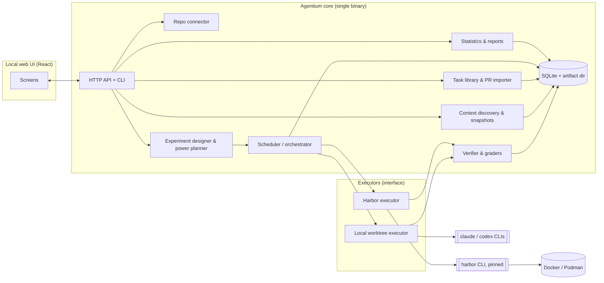
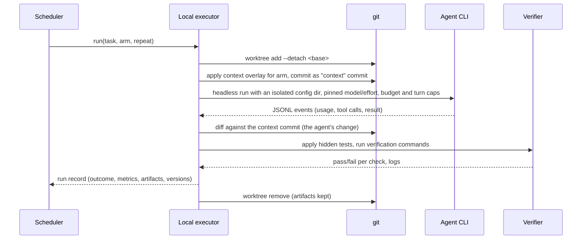

# AI Development Lab: technical research and feasibility study

- Date: 2026-09-27
- Status: research proposal. Nothing here is decided until the user accepts it in a decision record.
- Scope: the user's brief "AI Development Lab — Technical Research & Feasibility Study". Agentium is the working name for the product.

**How to read this report.** A statement followed by a source link was checked against current docs or source code on 2026-09-27. **(H)** marks a hypothesis that the Phase 0 spike must confirm. **(E)** marks an estimate, with its assumptions stated next to it.

## Contents

1. [Executive summary](#1-executive-summary)
2. [Existing solutions](#2-existing-solutions)
3. [Feature matrix](#3-feature-matrix)
4. [UX proposal](#4-ux-proposal)
5. [Context experimentation design](#5-context-experimentation-design)
6. [Technical architecture](#6-technical-architecture)
7. [MVP specification](#7-mvp-specification)
8. [Implementation roadmap](#8-implementation-roadmap)
9. [Risks and open questions](#9-risks-and-open-questions)
10. [Implementation strategies and recommendation](#10-implementation-strategies-and-recommendation)
11. [Sources](#11-sources)

---

## 1. Executive summary

**Concept.** Agentium is a local-first lab. It runs coding agents on tasks taken from the developer's own repository and measures how changing the agent, the model or the project's AI context changes three things: correctness, cost and speed. The AI context covers `AGENTS.md`, `CLAUDE.md`, skills, rules and referenced docs. Every comparison comes with honest statistics. Agentium sits beside Claude Code and Codex and does not replace them: it drives their headless modes and reads what they already report.

**Why it is worth building.** Developers keep investing in context files without evidence that they help, and the evidence so far is sobering:
- An ETH Zurich study found that context files generally do not improve task success, while raising inference cost by over 20% on average ([Gloaguen et al., 2026][paper-agentsmd]).
- A two-agent study of Claude Code and Codex over 288 runs bounded the effect of context on correctness to at most 10–15 percentage points, using equivalence testing ([Khatri, 2026][paper-khatri]).

Context changes therefore mostly move cost and behavior, and they move correctness only slightly. A tool that measures this on a developer's own repository replaces guesswork with evidence.

**Feasibility.** The technical building blocks exist:
- Both target agents have headless modes that emit usage data a machine can read. Claude Code reports `total_cost_usd`, token counts and turn counts ([cost tracking][cc-cost]). Codex reports token usage per turn and no cost ([Codex non-interactive mode][codex-exec]).
- An actively maintained open-source harness, Harbor, already runs Claude Code, Codex and about 40 other agents in containers. It repeats attempts and records trajectories, cost and tokens ([Harbor][harbor]).

The gap no tool fills yet is treating **context versions as experiment arms**, with paired statistics, tasks derived from the repository, and a workflow simple enough for everyday use. The closest existing pieces:
- `claude plugin eval` compares runs with and without a plugin. It covers only Claude and only plugins, and it deliberately strips project `CLAUDE.md` ([plugin evals][cc-plugin-eval]).
- Harbor's viewer compares averages per agent, model or job. It has no notion of a context version and no confidence intervals ([Harbor comparison source][harbor-compare]).

**The binding constraint is statistics, not engineering.** The paired-design numbers in [section 5.6](#56-minimum-statistical-methodology) give the scale:

| Design (tasks × runs per arm × 2 arms) | Smallest detectable cost change | Smallest detectable success change | Budget on Sonnet 5 **(E)** |
|---|---|---|---|
| 12 × 3 × 2 = 72 runs | about 22% | about 30 pp | about $94 |
| 20 × 5 × 2 = 200 runs | about 14% | about 18 pp | about $260 |
| 65 × 5 × 2 = 650 runs | about 8% | about 10 pp | about $845 |

So Agentium can reliably measure efficiency changes of about 20% or more for roughly $100. Certifying "no quality loss beyond 15 pp" takes about 230 runs, roughly $300 on Sonnet 5 **(E)**. Smaller quality differences must be labelled inconclusive, not presented as findings.

**Recommendation: a hybrid architecture** (details in [section 10](#10-implementation-strategies-and-recommendation)).
- **Agentium owns** the experiment model, context versioning, the task library, the statistics and the UX.
- **Local runs** drive agent CLIs directly in isolated git worktrees, so a first experiment needs no setup.
- **Harbor**, pinned and called through its CLI and result files, provides container isolation and public benchmarks later.
- **Proposed stack:** a Go core in a single binary, a local web UI in React, and SQLite. The stack still needs a decision.
- **Effort (E):** 10–12 person-weeks to the MVP, after a 1–2 week spike on a capped budget that confirms the cost and variance assumptions.

---

## 2. Existing solutions

### 2.1 Overview

Activity figures come from the GitHub API on 2026-09-27.

| Project | What it is | Useful for Agentium | Main gaps | License / activity | Verdict |
|---|---|---|---|---|---|
| [Harbor][harbor] | Harness from the Terminal-Bench authors for evaluating agents in sandboxes | Agent adapters (Claude Code, Codex and about 40 more); Docker, Podman and cloud sandboxes; `n_attempts`; cost and token capture; ATIF trajectories; local viewer; skill injection with content digests | No context-version concept; comparison view shows averages without intervals; tasks need a container environment; Python ≥3.12 with a heavy dependency tree | Apache-2.0; about 5.6k stars; v0.23.0 released 2026-09-12; ≥100 commits in 30 days | **Integrate** as the container executor, behind a process boundary |
| [Inspect AI][inspect] + [inspect_swe][inspect-swe] | UK AISI evaluation framework; inspect_swe adds Claude Code, Codex CLI, Gemini CLI and others as agents | Epochs with reducers (`pass_at_k`), clustered standard errors, `ci()`, a mature log viewer; model calls proxied through Inspect so usage is visible | Tasks are written as Python evals, a research workflow; inspect_swe is small (33 stars) | MIT; active | **Reference** for statistics and design; possible alternative engine |
| [Promptfoo][promptfoo] | Declarative evaluation and red-teaming CLI with a web viewer | Providers for the Claude Agent SDK and the Codex SDK; `--repeat`; matrix view; assertions | Prompt-centric; no workspace isolation (resetting side effects is left to the user); caches results by working directory; acquired by OpenAI in March 2026 | MIT; about 25k stars | **Reference**; not the core |
| [Langfuse][langfuse] | LLM observability, datasets and experiments | Tracing, OTel ingestion, dataset runs | Self-hosting needs Postgres, ClickHouse, Redis and S3, which is heavy for local-first; not agent- or repo-aware; acquired by ClickHouse in January 2026 | MIT outside `ee/`; about 35k stars | **Optional export target** later |
| [SWE-bench][swebench] family | Issue-resolution benchmark with a Docker harness; [SWE-smith][swesmith] generates tasks; [SWE-rebench][swerebench] is a continuously refreshed, decontaminated variant | Method for turning PRs into tasks (fail-to-pass and pass-to-pass tests); ideas for detecting contamination | Built for benchmarks; needs x86_64 with 120 GB of disk; SWE-smith does not support macOS | MIT | **Reuse the methodology**, not the code |
| [RepoBench][repobench] | Benchmark for repository-level code completion (ICLR 2024) | None directly: it measures autocomplete, not agents | Not agentic; last push August 2024 | CC-BY-4.0 | **Not relevant** |
| [Claude Code][cc-headless] / [Agent SDK][cc-features] | Headless CLI (`claude -p`) and Python/TypeScript SDK | `stream-json` events, `total_cost_usd`, `modelUsage`, `--max-budget-usd`, `--effort`, `--bare`, OTel metrics and events | Cost is a client-side estimate; user-level config leaks into runs unless isolated; the TypeScript SDK is under Anthropic's commercial terms | CLI proprietary; Python SDK MIT | **Integrate** through the CLI |
| [Codex][codex-exec] CLI / SDKs | `codex exec --json`; [TypeScript SDK][codex-sdk-ts] wraps the CLI; [Python SDK][codex-sdk-py] | Per-turn token usage including cached and reasoning tokens; `--ephemeral`, `--ignore-user-config`, `--output-schema` | No cost reporting; `AGENTS.md` capped at 32 KiB by default | Apache-2.0 | **Integrate** through the CLI |
| [`claude plugin eval`][cc-plugin-eval] and skill-creator | Claude Code's built-in plugin evaluations | Compares runs with and without the plugin (3 runs per case by default), graders including LLM judges, JSON and HTML reports | Early access; Claude only; plugins and skills only; project `CLAUDE.md` never loads; reports means and deltas, with no confidence intervals documented | Proprietary, bundled with Claude Code | **Closest overlap**. Complement it and do not copy it |
| [Agent Client Protocol][acp] | JSON-RPC protocol between editors and agents | One protocol for many agents (Claude through an adapter, Codex through `codex-acp`, Gemini, OpenHands and others) | Built for interactive editors; usage and cost reporting depends on the adapter | Apache-2.0 | **Later option** for more agents |
| Parallel-agent UIs, such as [Vibe Kanban][vibekanban] | Kanban plus worktrees for many agents | UX patterns for worktrees, diff review and switching agents | Sunsetting per its README, so orchestration UIs alone are hard to sustain | Apache-2.0 | **Lesson**: do not compete on orchestration |
| [Arize Phoenix][phoenix] | Observability and evaluation | Tracing | Elastic License 2.0 restricts offering it as a service | ELv2 | Skip |

### 2.2 Harbor in detail (strongest reuse candidate)

- **Task format.** A task is a directory with `instruction.md`, `task.toml`, `environment/` (a Dockerfile, compose file or other spec), an optional `solution/`, and `tests/test.sh`. The test script writes a reward to `/logs/verifier/reward.txt` or `reward.json`. Rewards can have several dimensions ([tasks][harbor-tasks]). Tasks do not depend on Harbor itself, which makes the format portable.
- **Jobs.** YAML or JSON configs support several agents and tasks. Relevant fields ([configs][harbor-configs]):
  - `n_attempts` (repeats), `n_concurrent_trials` and a retry policy;
  - per-agent `model_name`, `kwargs`, `env`, `skills`, `mcp_servers` and timeout overrides;
  - `extra_instruction_paths`, and a Python API (`Job.create(JobConfig(...))`).
- **Skill injection with provenance.** Skills from local paths or git repositories are uploaded per trial. The job lock records each skill's SHA-256 digest and commit ([skills][harbor-skills]). This is the closest existing feature to context versioning, but it covers skills only, not repository instruction files.
- **Claude Code adapter** ([source][harbor-claude]):
  - installs Claude Code in the sandbox via npm or the bootstrap script;
  - runs `claude --verbose --output-format=stream-json --print` with `--permission-mode=bypassPermissions` by default (the container is the boundary);
  - takes `total_cost_usd` from the final result event and falls back to LiteLLM pricing;
  - fills `cost_usd` and the input, cache and output token counts.
- **Sandboxes.** Only containers: `docker` (the default), `podman`, `apple-container` and `singularity`, plus about 25 cloud providers. There is no host-process mode ([sandboxes][harbor-sandboxes]).
- **Viewer.** `harbor view jobs` serves a local UI with trajectories, files, artifacts, config and lock per trial, and a compare page. The compare page groups by task, dataset, job, agent or model and shows the average reward, cost, tokens and time ([viewer][harbor-viewer], [comparison source][harbor-compare]). It shows no variance, intervals or pairing.
- **Supply chain.** Harbor depends on LiteLLM, whose PyPI releases 1.82.7 and 1.82.8 shipped a credential stealer on 2026-03-24 ([LiteLLM advisory][litellm]). Harbor requires `litellm>=1.92.0`, which is past the bad releases, but the dependency tree is large (also Supabase and FastAPI). That is a reason to keep Harbor out of process and pinned.

### 2.3 What the agent CLIs expose (the measurement surface)

| Metric | Claude Code (`claude -p --output-format stream-json`) | Codex (`codex exec --json`) |
|---|---|---|
| Input and output tokens | Direct: result `usage`; per-model `modelUsage` includes subagents | Direct: `turn.completed.usage` (`input_tokens`, `output_tokens`) |
| Cache tokens | Direct: `cache_read_input_tokens`, `cache_creation_input_tokens` | Direct: `cached_input_tokens`; reasoning tokens reported separately |
| Cost | Direct but estimated: `total_cost_usd` from a price table bundled in the client ("not authoritative billing data") | **Not reported**. Agentium must price the tokens |
| Turns and iterations | Direct: `num_turns` | Derived: count `item.*` events (commands, file changes, MCP calls) |
| Duration | Direct: `duration_ms` and `duration_api_ms` | Derived: measured by the wrapper |
| Tool calls | Derived from `tool_use` blocks in the stream; subagent messages carry `parent_tool_use_id` | Derived from `item.*` types |
| Retries and API errors | Direct: `system/api_retry` events with an error category | Derived: `turn.failed` |
| Context loading overhead | Derived: input plus cache-creation tokens of the first model request (per-step usage is exact for input and cache; per-step output is a placeholder) | Only static estimates, because per-step usage is not exposed |
| Task success and test results | **Needs Agentium's verifier** | **Needs Agentium's verifier** |
| Failed attempts and self-corrections | **Needs instrumentation**: failing test or build commands found in the trajectory | same |
| Instruction compliance, such as "ran the required checks" | **Needs trajectory graders** | same |

Sources: [Claude cost tracking][cc-cost], [Claude headless mode][cc-headless], [Codex non-interactive mode][codex-exec].

Claude Code can also export OTel metrics (`claude_code.token.usage`, `claude_code.cost.usage`, and more) and events (`api_request`, `tool_result`, and more), with content redacted by default ([monitoring][cc-otel]). For a local lab, parsing `stream-json` is simpler and loses nothing. OTel becomes useful once teams share results.

### 2.4 How each agent loads context (it decides what an experiment really changes)

- **Claude Code** loads `CLAUDE.md` from the working directory and every parent, plus `.claude/rules/*.md`. Since v2.1.277 it also reads `AGENTS.md` itself, but by default only when no `CLAUDE.md` or `CLAUDE.local.md` exists in the working directory or above it; a built-in `agents-md` plugin setting can change that ([memory][cc-memory]). *(Corrected 2026-09-27 during the Phase 0 spike.)* It loads `CLAUDE.md` files in subdirectories on demand, loads skills on demand, and resolves hooks and settings from `.claude/`. User-level `~/.claude` files and auto memory also load unless excluded. In the SDK, `settingSources` limits this. Managed policy and `~/.claude.json` load regardless; `CLAUDE_CONFIG_DIR` relocates the latter ([Claude Code features in the SDK][cc-features]). `--bare` skips `CLAUDE.md`, hooks, skills and memory entirely ([headless][cc-headless]). That makes it unsuitable for context experiments, because it removes the very thing under test.
- **Codex** loads the global `AGENTS.override.md` or `AGENTS.md` from `CODEX_HOME`, then walks from the project root down to the working directory. It concatenates files root first, so files closer to the working directory win. It stops at `project_doc_max_bytes`, 32 KiB by default ([AGENTS.md discovery][codex-agentsmd]). Whether it resolves `@file` imports is not documented. **(H)**: it reads them as plain text.

So the same repository gives different effective context per agent. For example, an `AGENTS.md` over 32 KiB is cut off for Codex, yet loads in full for Claude when `CLAUDE.md` imports it with `@AGENTS.md`. Agentium must show the effective context per agent, not only a file list.

### 2.5 Research relevant to the product

- Gloaguen et al. (arXiv 2602.11988, v2 June 2026): context files do not generally improve success and raise cost by over 20%. Agents follow the instructions, but repository overviews do not help ([paper][paper-agentsmd]).
- Khatri (arXiv 2607.27250, July 2026): Claude Code and Codex on 17 real tasks, 288 runs. No measurable correctness effect, bounded to ≤10–15 pp. Failures come from implementation skill, not missing knowledge ([paper][paper-khatri]).
- Miller, "Adding Error Bars to Evals" (Anthropic, arXiv 2411.00640): use CLT standard errors and clustered errors (which can be over 3× larger), analyse paired differences, plan with power analysis, and sample several answers per question ([paper][paper-errorbars]).

Implication: the market need is real, since practitioners cannot tell whether their context helps. The product must lead with cost and behavior metrics, and gate correctness claims behind sufficient sample sizes.

---

## 3. Feature matrix

| Capability | MVP | Later | Build or reuse |
|---|---|---|---|
| Connect a local git repository; detect installed agents, their versions and credential mode | ✓ | Remote clone, GitHub App | Build |
| Context discovery: effective context per agent, sizes, token estimates, warnings (32 KiB cap, broken `@` imports, stale references) | ✓ | LLM-assisted redundancy and contradiction hints | Build |
| Context snapshots, named variants and diffs (file and effective-context level) | ✓ | Section-level leave-one-out ablation | Build on git objects |
| Tasks: custom (instruction, base ref, verification commands, optional hidden tests) | ✓ | | Build |
| Tasks from merged PRs: base commit, instruction, hidden tests, validation | ✓ | Bulk mining; decontamination dates per model | Build, following SWE-bench and SWE-rebench |
| Tasks from GitHub issues (instruction only, with user-written checks) | | ✓ | Build |
| Experiment templates: Context A/B, Agent/Model comparison, A/A calibration | ✓ | Multi-arm, effort sweeps | Build |
| Power and cost preview before running | ✓ | Adaptive planning from pilot data | Build |
| Local worktree executor with isolated agent config | ✓ | | Build |
| Container executor | | ✓ | **Harbor** |
| Adapters: Claude Code and Codex | ✓ | ACP-based agents; any Harbor agent | Build (thin); Harbor later |
| Deterministic verification: tests, build, lint and diff hygiene | ✓ | Coverage deltas | Build |
| Trajectory graders: tool used, command run, file touched | ✓ | | Build, modelled on plugin-eval graders |
| LLM rubric judge (secondary, blinded, repeated) | | ✓ | Build |
| Paired statistics and verdicts (improved, regressed, equivalent, inconclusive) | ✓ | Sequential designs | Build (small, standard library only) |
| Live progress, budget stop, resume after interruption | ✓ | | Build |
| Results report, run drill-down (transcript, diff, tests), Markdown and JSON export | ✓ | HTML share, PR comment | Build; link to Harbor viewer for container runs |
| History and trends across context versions and models | | ✓ | Build |
| Public benchmarks (SWE-bench and Terminal-Bench datasets) | | ✓ | **Harbor** datasets |
| Team sharing, OTel export, Langfuse export | | ✓ | Reuse |
| Claude Code plugin or skill (`/agentium compare`) and CI mode | | ✓ | Build (thin) |

---

## 4. UX proposal

### 4.1 Platform choice

| Option | Advantages | Disadvantages | Verdict |
|---|---|---|---|
| **Local web UI served by the Agentium binary** (`agentium ui` opens `127.0.0.1` with a session token) | Full host access (git, agent CLIs, Docker) with no browser limits; one codebase for the CLI and UI; no signing or packaging; works over SSH port forwarding | Needs a terminal to start; less native feel | **MVP** |
| Desktop app (Wails or Tauri wrapper) | Native install, tray, notifications | Signing and notarization, auto-update, platform bugs; no functional gain | Later, only if non-technical users matter |
| IDE extension | Close to the code | One per IDE; experiments run for minutes to hours, which does not fit the IDE loop | Later, as a thin launcher |
| Claude Code plugin or skill | Where the user already works; cheap | Text-only results; the Claude side only | Later, alongside the UI |
| CLI only | Scriptable, fits CI | Poor for comparisons and drill-down | Always kept for parity and CI |

This also answers an earlier question from the Orchid work: a browser cannot run agents itself, but a local server with a browser UI gets host access without shipping a desktop app.

### 4.2 Information architecture

```text
Agentium
├── Projects (connected repositories)
│   └── Project
│       ├── Overview        context health, agents found, recent experiments, "New experiment"
│       ├── Context         effective context per agent · snapshots timeline · compare two snapshots
│       ├── Tasks           task library · import from PR · validate
│       ├── Experiments     list · new (template wizard) · live run · results report
│       └── History         trends by context version and model
├── Agent profiles          agent × model × effort × permissions (reusable, global)
└── Settings                executors, budgets, credential status (never values), price tables
```

Navigation principle: everything hangs off a project. Experiments are the unit of work. Results always link back to the exact snapshots, tasks and profiles they used.

### 4.3 Main screens

1. **Projects.** Connected repositories, plus a "Connect repository" action that takes a path. Discovery runs immediately and shows its findings.
2. **Project overview.**
   - A context health card: tokens per agent, files, warnings.
   - Task count and validation state.
   - The last three experiment verdicts.
   - A primary button: "New experiment".
3. **Context.**
   - Left: a tree of context files, grouped by the agent that loads them (Claude, Codex, both).
   - Right: file content with its token count.
   - A timeline of snapshots, with "Snapshot working tree" and "Compare…".
4. **Context compare.** A side-by-side diff of two snapshots, with a per-agent effective size delta and warnings, such as "variant B pushes AGENTS.md over Codex's 32 KiB limit" or "B changes hooks and permissions, which are harness settings".
5. **Tasks.**
   - A table: name, source (custom or PR number), base, verification, validation status, baseline pass rate once known, and a "discriminating" badge.
   - "Import from PR" shows the proposed instruction, which the user edits so it does not leak the solution. It also shows the hidden tests and a validation result.
6. **New experiment wizard** (three steps, each with defaults):
   1. What to compare: a template, then the arms.
   2. Which tasks: a suggested set, which the user edits.
   3. How sure you need to be: runs per task, a budget cap, and a live preview of detectable effects and cost. Then "Run".
7. **Live run.**
   - A grid of tasks × arms × repeats; cells fill as runs finish (pass, fail, infra error).
   - A running cost meter against the cap; ETA; pause, resume and cancel.
   - A log tail for the selected run.
8. **Results report.**
   - A verdict banner per metric with its confidence interval.
   - Metric cards; a per-task table with per-run dots; notes on "what changed".
   - Drill-down into any run.
   - Export: Markdown or JSON. "Apply variant" commits the variant on a branch.
9. **Run detail.** Transcript timeline (messages, tool calls, commands with exit codes), the agent's diff, verifier output, and metrics. For container runs, a link to the Harbor viewer.
10. **History.** A chart per metric across context snapshots and models. It only plots results from comparable experiments.

### 4.4 Journey A: compare agents or configurations

Numbers in both journeys are illustrative.

1. **Connect.** `agentium ui`, then "Connect repository". Discovery reports: Claude Code 2.1.x found (API key set), Codex found, 3 context files, and `go test ./...` detected.
2. **Tasks.** "Import from PR" for 9 recent merged PRs with test changes, then "Validate all". Eight pass validation and one is flagged because its tests pass before the fix.
3. **New experiment.** Choose "Agent/Model comparison" and pick profiles "Claude Code · Sonnet 5 · high" and "Codex · default model". The 8 valid tasks are pre-selected with 3 runs each (the "Quick" tier).
4. **Preview.** "24 runs per arm, about $31 for the Claude arm **(E)**. Codex is priced from its token counts as runs finish. Detects cost or time differences of about 26% or more; success differences under about 37 pp will read as inconclusive." Run.
5. **Watch.** The grid fills. One Codex run fails with an infra error (rate limit); it is retried automatically and shown separately.
6. **Read.** Success 71% vs 62%, Δ +9 pp [−17, +35]: *exploratory* (fewer than 20 tasks). Time 4.2 vs 6.8 min: *Claude faster, ratio 0.62 [0.50, 0.77]*. Cost per solved task $1.84 vs $1.37. Tool-call patterns differ.
7. **Act.** Export the report. Optionally duplicate the experiment with more tasks.

### 4.5 Journey B: context A/B (the key workflow)

1. The developer edits `AGENTS.md` and `.claude/skills/` in their working tree, as usual.
2. Agentium's project overview notices: "Context changed since the last snapshot. Compare against HEAD?" One click creates snapshot A (HEAD) and snapshot B (working tree) and opens the compare view. The view shows −38% tokens for Claude, −41% for Codex, and one removed skill.
3. "Test this change" opens the wizard with the Context A/B template pre-filled.
   - Same agent profile for both arms. The default is the user's usual profile, which changes only if they choose to.
   - The primary goal: "Cheaper without hurting quality" (the default). The alternatives are "More successful" and "Better process compliance".
   - The task set: validated tasks that touch the areas the diff mentions, plus a stratified sample.
4. The preview offers two tiers instead of raw numbers, plus "Custom":
   - **Quick:** 12 tasks × 3 runs, about $94 **(E)**. Measures cost changes of about 22% or more, but only flags quality drops of about 30 pp or more.
   - **Confident:** 23 tasks × 5 runs, about $300 **(E)**. Measures cost changes of about 13% or more, and certifies "no quality loss beyond 15 pp" when there is none (80% power).

   For compliance goals the user adds checks, such as "the agent runs `harness.py check changed` before finishing".
5. Runs are interleaved: A and B of the same task and repeat are scheduled next to each other.
6. With the Confident tier, the report reads, for example: "**Cost −24% [−31%, −16%]**. Success 80% → 78%, Δ −2 pp [−14, +10]: **no quality loss beyond 15 pp**. Compliance 90% → 95%, inconclusive. Context overhead −9.1k tokens per session."
7. "Keep B" commits the context change on a new branch with the report attached, ready for a PR.

At no point does the user create branches, write scripts or aggregate metrics.

### 4.6 Wireframes

Context compare:

```text
┌ Context · compare ─────────────────────────────────────────────────────────┐
│ A: HEAD (2026-09-27 a1b2c3)        B: working tree (unsaved snapshot)       │
│ Effective size   Claude 14.2k → 8.8k tok (−38%)   Codex 13.1k → 7.7k (−41%) │
│ ⚠ B removes skill "release-notes"      ⚠ B edits .claude/settings.json      │
├──────────────────────────────┬──────────────────────────────────────────────┤
│ AGENTS.md          −62 lines  │ - ## Repository overview                     │
│ .agents/rules/core −8 lines   │ - The project has three packages…            │
│ .claude/skills/…   removed    │ + Run `harness.py check changed` before …    │
├──────────────────────────────┴──────────────────────────────────────────────┤
│ [Test this change →]   [Save snapshot B]                                    │
└─────────────────────────────────────────────────────────────────────────────┘
```

Experiment plan with power preview:

```text
┌ New experiment · Context A/B · step 3 of 3 ────────────────────────────────┐
│ Arms: A = HEAD context · B = working tree       Agent: Claude Code · Sonnet 5│
│ Tier: (•) Quick  ( ) Confident ~$300  ( ) Custom                              │
│ Tasks: 12 validated (8 from PRs, 4 custom)      Runs per task per arm: 3      │
│ Budget cap: [$120]    Estimated: 72 runs · ~$94 · ~1h40m at 4 in parallel     │
│ With this plan you can detect:                                              │
│   cost change  ≥ ~22%   ██████████░░  good                                  │
│   success Δ    ≥ ~30 pp ███░░░░░░░░░  weak: only large drops are caught      │
│ Primary goal: (•) cheaper without hurting quality  ( ) more successful      │
│ [Back]                                                   [Run experiment]  │
└─────────────────────────────────────────────────────────────────────────────┘
```

Results report:

```text
┌ Results · "Trim AGENTS.md overview" · Confident · 230/230 runs · $291.60 ───┐
│ ✔ Cost per run      −24%  [−31%, −16%]   improved                           │
│ ≈ Success           80% → 78%  Δ −2 pp [−14, +10]   no loss beyond 15 pp     │
│ ? Compliance checks 90% → 95%  [−4, +14]   inconclusive                     │
│ ✔ Context overhead  −9.1k tokens per session                                │
├ Per task ──────────────────── A runs ─ B runs ─ cost A → B ─ note ──────────┤
│ fix-flaky-retry (PR 214)      ●●●      ●●●      $1.42 → $1.01               │
│ add-csv-export  (PR 231)      ●○●      ●●○      $2.10 → $1.77  mixed        │
│ …                                                                           │
├─────────────────────────────────────────────────────────────────────────────┤
│ [Keep B → branch]  [Run more tasks]  [Export Markdown]  [Open run details]  │
└─────────────────────────────────────────────────────────────────────────────┘
```

### 4.7 Rules that keep the product simple

- Every screen has one primary action, and every wizard step has a working default.
- Statistics appear as plain verdicts with an interval. Formulas live behind an "About this result" link.
- Configuration comes from discovery, not forms. Agent profiles are the only reusable configuration object.
- Nothing appears that the user cannot act on: no raw metric dumps on the main report.

---

## 5. Context experimentation design

### 5.1 What counts as context, and discovery

Context is every file that an agent loads, or that changes how the harness behaves, for a given repository and working directory:

| Class | Claude Code | Codex | Treated as |
|---|---|---|---|
| Instructions | `CLAUDE.md` (with `@` imports), `.claude/rules/*.md`, `CLAUDE.md` in subdirectories; `AGENTS.md` when no `CLAUDE.md` exists (v2.1.277+) | `AGENTS.md` / `AGENTS.override.md` hierarchy, fallback filenames | Context |
| On-demand knowledge | `.claude/skills/*/SKILL.md`, `.claude/agents/*`, `.claude/commands/*` | `.agents/skills` **(H)** for repo scope | Context |
| Referenced docs | Files pulled in through `@` imports or linked from instructions | Linked files (read only if the agent chooses to) | Context |
| Harness settings | `.claude/settings.json` (permissions, hooks), `.mcp.json` | `.codex/config.toml` **(H)** | **Harness**: allowed in a variant only with a warning |
| Personal | `CLAUDE.local.md`, `.claude/settings.local.json`, `~/.claude/*` | `$CODEX_HOME/*` | Excluded, and isolated during runs |

Discovery parses these rules and produces, per agent:
- the ordered list of files it would load at session start;
- the files it may load on demand;
- sizes and token estimates;
- warnings: broken imports, the Codex 32 KiB cap, links to files missing at a task's base commit, and duplicated paragraphs.

Token estimates are approximate without an API call. Exact counts can use the provider's token-counting endpoint when the user allows it.

### 5.2 Snapshots and versioning

- A snapshot is the set of context files, with full contents, captured from HEAD, a branch or the working tree. It is stored as a parentless git commit whose tree holds only those files, under a hidden ref (`refs/agentium/snapshots/<id>`). That gives content addressing, diffs and history for free, with nothing written to the user's branches.
- A snapshot's manifest records the path, SHA-256, bytes and which agents load each file.
- Snapshots are immutable. Editing creates a new one, and a snapshot can be derived from another ("B = A without section X").

### 5.3 Applying variants fairly

- Both arms apply their snapshot as an **overlay** on each task's base commit: they replace the context paths and delete files the snapshot lacks. So "A" on a historical task means current context A, not the context as it was when the PR was merged. This isolates the context as the only difference. The report warns when the current context mentions files that do not exist at an old base.
- The overlay is committed in the run's worktree as a separate "context" commit, so the agent's own diff is measured cleanly.
- A context experiment must differ **only** in context paths. The designer refuses arms that differ in profile, task set or verification, or clearly relabels the experiment as a mixed comparison.

### 5.4 Controlled execution

1. **Same everything except the context:**
   - the same agent CLI version (checked per run);
   - the same model ID and effort;
   - the same permission policy, turn cap, budget cap and timeouts;
   - the same executor and the same instruction text.
2. **User-level isolation.** Each run gets an empty agent config directory:
   - Claude: `CLAUDE_CONFIG_DIR` plus `CLAUDE_CODE_DISABLE_AUTO_MEMORY=1` ([features][cc-features]);
   - Codex: `CODEX_HOME`, `--ignore-user-config` and `--ephemeral` ([exec][codex-exec]).

   **(H)** Whether an isolated `CLAUDE_CONFIG_DIR` still loads the project `CLAUDE.md` while excluding the user's must be confirmed in the spike.
3. **Interleaved, randomized order.** Pairs (A, B) of the same task and repeat run back to back in random order within the pair, at the same concurrency, so time-of-day latency and API conditions hit both arms equally.
4. **Prompt-cache fairness.** Runs of the same arm share cached prefixes and get cheaper as the experiment proceeds. Interleaving spreads this evenly. The report shows cost at reported prices, the cache-read share per arm, and a "cold-cache" price (all cached input repriced at the write rate) as a sensitivity check.
5. **An A/A calibration run** is offered on a repository's first experiment: the same snapshot in both arms. It must come out "no difference". It measures the noise floor, the per-run spread `σ` and success variance, which feed the power planner for later experiments.

### 5.5 Metrics

| Metric | Definition | Primary for |
|---|---|---|
| Success | All verification checks pass: hidden tests, required commands and no forbidden changes. Binary per run | "More successful" goal; guard metric for the others |
| Cost per run | Priced dollars for all model calls, including subagents | "Cheaper" goal |
| Cost per success | Total cost / successes per arm (ratio of sums) | Reporting |
| Duration | Wall-clock time of the agent phase | Secondary |
| Tokens | Input, output, cache read and cache write; within one model only | Secondary |
| Turns and tool calls | Per agent's own definition (section 6.7) | Secondary |
| Context overhead | Claude: input plus cache-write tokens of the first model request; both agents: static estimate | Explaining cost changes |
| Compliance | Share of runs passing trajectory graders (for example "ran the tests", "did not edit generated files") | "Process compliance" goal |
| Failed attempts | Count of failing test or build commands inside the trajectory before the end | Secondary |

LLM judges are **not** used for primary metrics in the MVP. Later, rubric judging can score qualities tests cannot see. It will be blinded to the arm, run pairwise, repeated with agreement reported, and never allowed to override a failing test.

### 5.6 Minimum statistical methodology

**Design.** A paired design where the task is the unit: `n` tasks, `R` runs per arm per task. For each task, compute the difference between arm means, `D_i = mean(B) − mean(A)`. Differencing removes task difficulty, which is the largest source of variance.

**Variance model** used by the planner, following Miller's paired and clustered analysis ([paper][paper-errorbars]):

```text
Var(D_i) = τ² + 2·w / R
  w  = within-task variance of one run: p(1−p) for success; σ² of log cost for cost
  τ² = spread of the true effect across tasks
Minimum detectable effect (80% power, two-sided α = 0.05):  MDE = 2.80 · sqrt(Var(D_i) / n)
```

**Assumptions (E)**, to replace with A/A pilot data per repository:
- success: `w = 0.20` (mixed task difficulty), `τ = 0.05`;
- cost: per-run log-cost `σ = 0.35` (a coefficient of variation of about 35%), `τ = 0.10`;
- per-run price, assuming about 0.2M cache-write tokens, 2.16M cache-read tokens, 0.04M uncached input and 30k output (thinking included): **Sonnet 5 about $1.31, Opus 5.5 about $2.19**, from [verified prices][anthropic-pricing].

| Tasks × runs per arm | Runs total | Success MDE | Cost MDE | Budget: Sonnet 5 / Opus 5.5 **(E)** |
|---|---|---|---|---|
| 8 × 3 | 48 | 36.5 pp | 25.9% | $62 / $106 |
| 12 × 3 | 72 | 29.8 pp | 21.7% | $94 / $158 |
| 20 × 3 | 120 | 23.1 pp | 17.3% | $156 / $264 |
| 20 × 5 | 200 | 18.0 pp | 14.1% | $260 / $440 |
| 40 × 5 | 400 | 12.7 pp | 10.2% | $520 / $880 |
| 65 × 5 | 650 | 10.0 pp | 8.1% | $845 / $1,430 |

> **Measured in Phase 0 (2026-09-27):** on six small harness tasks, the per-run log-cost spread was σ = 0.19 and the cross-task spread τ = 0.05, both about half the assumptions above. A cost run averaged $0.29. So 12 × 3 runs detect about 12% cost changes, not 22%. Success could not be calibrated because 57 of 60 runs passed, so keep `w = 0.20` for planning. See the [Phase 0 results](2026-09-27-phase0-spike-results.md).

As `R` grows, `τ²` dominates. Past about 5 runs per task, adding tasks buys more than adding runs.

A quality guard needs fewer runs than detecting an improvement. The planner sizes it for a non-inferiority test with margin `m`, a one-sided α of 0.05, 80% power and no true difference: `n = (1.645 + 0.84)² · Var(D_i) / m²`.
- With `m` = 15 pp, that gives **23 tasks × 5 runs (230 runs, about $300 on Sonnet 5 or $506 on Opus 5.5)**. This is the "Confident" tier in section 4.5.
- Its cost MDE is 13.2%.
- 38 tasks × 3 runs (228 runs) gives the same guard.

**Minimum methodology Agentium enforces:**

1. **Pre-declare** the primary metric, the arms, the task set, `R`, the budget and the decision margins before the first run. They are stored in the lock, and changing them creates a new experiment.
2. **Pairing and interleaving** as in section 5.4.
3. **Floors.** At least 3 runs per task per arm. At least 8 tasks for cost claims and at least 20 for success claims. Below a floor, that metric is labelled "exploratory" and gets no verdict, with one exception: a regression whose 95% interval excludes zero is still raised as a warning.
4. **Analysis:**
   - Success: the mean paired difference with a **cluster bootstrap** 95% interval (resample tasks, then runs within each task, 10,000 draws).
   - Cost and time: the **geometric-mean ratio** from paired log differences, with a bootstrap interval.
   - Consistency across repeats (pass^k) is reported next to mean success (pass@1).
   - Infra-failed runs are excluded and counted separately. Tasks that every run passes or every run fails stay in for cost but are marked "not discriminating" for success.
5. **Decision rule per metric**, with a margin `m` (defaults: 10% for cost and time, 15 pp for success; editable before the run):
   - **Improved:** the 95% interval excludes zero on the better side. When the estimate is smaller than `m`, the verdict reads "improved, but small".
   - **Regressed:** the 95% interval excludes zero on the worse side.
   - **No loss beyond `m`** (for the guard metric): the worse end of the 90% interval, a one-sided 5% test, stays within `m`. **Equivalent:** the whole 90% interval lies within ±`m` (TOST).
   - **Inconclusive:** anything else. The report shows how many more tasks would likely resolve it, computed from the observed variance.
6. **One primary metric.** Secondary metrics carry Holm-corrected verdicts or are marked exploratory.
7. **No optional stopping.** "Run more" adds a pre-declared extension stage, at most two extensions. Interim looks use 99% intervals, so peeking until significant cannot inflate false positives.

### 5.7 Reporting

- A verdict per metric in plain words, with the estimate and interval (see the wireframe in section 4.6).
- "What changed": the effective-context diff per agent, including token deltas.
- A per-task table (per-run dots, cost A → B) so the developer sees whether one task drives the result.
- Behavior differences from trajectories: the most frequent tool-call and command differences between arms, as leads for interpretation, not as verdicts.
- Honesty notes: excluded runs, version drift, the cache-read share, and the non-discriminating tasks.
- Export: Markdown for PR descriptions, plus JSON with the full lock and per-run data.

### 5.8 Are context experiments reliable enough to justify their cost?

- **Yes, for efficiency and behavior.** Cost, time and token changes of about 22% or more are detectable with 12 tasks × 3 runs per arm, about $94 on Sonnet 5 **(E)**. Published studies show context changes do move cost by 20% or more ([Gloaguen][paper-agentsmd]). That is the realistic everyday use: "make our context leaner without hurting quality."
- **A quality guard is affordable; quality improvements mostly are not.**
  - Certifying "no quality loss beyond 15 pp" takes about 230 runs: roughly $300 on Sonnet 5 or $500 on Opus 5.5 **(E)**.
  - Detecting a 10 pp success change takes about 650 runs: roughly $850 on Sonnet 5 or $1,430 on Opus 5.5 **(E)**.
  - The literature bounds typical effects on correctness at about 10–15 pp or less ([Khatri][paper-khatri]). Most small correctness experiments will therefore, correctly, end up "inconclusive" or "no loss beyond the margin".
- **The product must design for this.** Show detectable effects before spending, as two tiers (Quick and Confident). Make "no loss beyond the margin" a first-class positive outcome. Offer cheaper models for screening variants and reserve the expensive model for confirmation.

---

## 6. Technical architecture

### 6.1 Components



| Component | Responsibility |
|---|---|
| Repo connector | Registers a local repository, reads git history, and finds merged PRs through `gh` or the GitHub API with the user's token |
| Context discovery and snapshots | Resolves the effective context per agent, stores snapshots as git objects, diffs them and warns (section 5.1) |
| Task library | Stores tasks, imports and validates them, and marks tasks that tell arms apart |
| Experiment designer | Arms, task set and repeats; power and cost preview; writes the experiment lock |
| Scheduler | Builds a randomized, interleaved run order; limits concurrency and budget; handles retries and resume |
| Executors | Prepare the workspace, run the agent, collect raw events, run verification, and tear down |
| Verifier and graders | Tests, build and lint checks, hidden tests, diff hygiene, and trajectory graders |
| Statistics and reports | Paired analysis, verdicts, per-task tables and exports |
| Store | SQLite for entities and metrics, with an artifact directory for transcripts, diffs and logs |

### 6.2 Run lifecycle



### 6.3 Executors

| | Local worktree executor (MVP) | Harbor executor (Phase 3) |
|---|---|---|
| Setup for the user | None: uses the host toolchain and the installed agent CLIs | A container environment per repository: generated from `go.mod`, `package.json` or `.devcontainer` **(H)** plus pinned Harbor |
| Isolation | A separate worktree and agent config directory. Relies on the agents' own sandboxes (Claude Code's sandboxed Bash, Codex's `workspace-write`). Never uses `bypassPermissions` on the host | Container per trial, network policies and egress allowlists; `bypassPermissions` only inside the container |
| Reproducibility | Host drift (toolchain versions) is recorded, not controlled | Image digest pinned |
| Parallelism | Limited by host resources, ports and shared services | Local containers or cloud sandboxes |
| Metrics | Agentium's Claude and Codex parsers | Harbor result files and ATIF trajectories, imported |
| Best for | The developer's own trusted repositories and quick experiments | Untrusted code, rigorous reproducibility, public benchmarks |

The executor interface is part of the MVP even though only the local executor ships then, so Harbor slots in without touching the experiment model.

**(H) Harbor mapping**, to validate in the spike:
- Each task and arm becomes a Harbor task whose Dockerfile builds `FROM` a shared per-base-commit image and copies the context overlay in.
- Agent profiles become `agents[]` entries with `model_name`, `kwargs` and `env`.
- Repeats become `n_attempts`.
- Agentium imports each trial's result, reward and trajectory.

### 6.4 Data model

```text
Project(id, path, remote, default_branch)
ContextSnapshot(id, project, name, source_ref, source_commit, tree_hash, manifest{path, sha256, bytes, loaded_by[]}, created_from)
AgentProfile(id, agent, cli_version_constraint, model, effort, permission_policy, flags)
Task(id, project, source{custom|pr|issue}, base_commit, instruction, verify_cmds[], hidden_test_patch, gold_patch?, tags[], validation{fails_on_base, passes_with_gold}, created_at)
Experiment(id, project, template, arms[{name, profile, snapshot}], tasks[], repeats, budget, primary_metric, margins, lock{...}, status)
Run(id, experiment, arm, task, repeat, order, status{queued|running|ok|agent_error|infra_error|timeout|cancelled|budget_stopped},
    started, ended, versions{agent_cli, model_reported}, metrics{tokens_in, tokens_out, cache_read, cache_write, cost_reported, cost_priced, turns, tool_calls, duration}, outcome{checks[], success}, artifacts{transcript, diff, logs})
Report(experiment, computed_at, method_version, results{metric → estimate, ci, verdict}, per_task[])
```

### 6.5 Technology stack (proposal)

| Layer | Proposal | Reason |
|---|---|---|
| Core, CLI, API, orchestration | **Go**, in one static binary | The owner's main language (Orchid is Go + React). Strong at process supervision and concurrency. Simple distribution. Both vendor SDKs wrap the CLIs anyway: the Codex TypeScript SDK "spawns the CLI and exchanges JSONL events" ([source][codex-sdk-ts]), and `claude -p` is the CLI form of the Claude Agent SDK ([source][cc-headless]) |
| Storage | SQLite, plus a plain artifact directory | Local-first; one file; easy backup |
| UI | React + TypeScript, built into the binary | Owner's expertise; reuses the Orchid UI experience |
| Statistics | Implemented in-house: bootstrap, Wilson intervals, t quantiles, TOST | A few hundred lines, and it avoids a heavy scientific dependency |
| Container execution | Harbor, pinned, invoked as a subprocess with config and result files | Keeps its Python ≥3.12 dependency tree and 0.x API churn outside our process |
| Charts, SQLite driver, router | To be chosen in the stack decision, each vetted under the dependency rules | Supply-chain priority |

Alternative: **Python** if Agentium later wants to embed Harbor or Inspect in-process (their Python APIs). It trades a tighter integration for their dependency trees and the owner's weaker stack fit. Not recommended for the MVP.

### 6.6 Reproducibility and provenance

Every experiment writes a lock, stored with its results, that records:
- the Agentium version and method version;
- per arm: the agent CLI version (`claude --version`, `codex --version`), the model ID as requested and as reported, effort, flags and the permission policy;
- the snapshot tree hash and per-file SHA-256;
- per task: the base commit, instruction hash, verification commands and hidden-test hash;
- the executor type and host facts (OS, toolchain versions), or the image digest for Harbor;
- the price table version and date.

Runs record the versions they actually saw. If the agent CLI auto-updates mid-experiment, the version mismatch appears in the report and the affected runs are flagged. How to disable auto-update reliably is an open item for the spike.

### 6.7 Provider differences

- **Tokens are not comparable across providers or model generations.** Claude 4.7+ and Sonnet 5 use a tokenizer that produces about 30% more tokens for the same text ([pricing][anthropic-pricing]). Cross-agent and cross-model comparisons use **dollars and time**; token comparisons are allowed only within one model.
- **Cost:**
  - Claude reports an estimate. Codex reports none.
  - Agentium prices every run from its own versioned price table, using verified multipliers: 5-minute cache writes cost 1.25× the input price, 1-hour writes 2×, and cache hits 0.1× (0.05× on Opus 5.5) ([pricing][anthropic-pricing]).
  - Both the reported and the priced figure are shown when both exist.
- **Iterations:** Claude reports turns. For Codex, Agentium counts items. Reports label the metric per agent and do not compare turns across agents.
- **Sampling:** current Claude models reject non-default `temperature`, `top_p` and `top_k` with a 400 error ([Sonnet 5 migration guide][sonnet5-migration]), and Claude Code exposes no seed. So variance cannot be removed, only measured with repeats. **(H)** Codex is similar.

### 6.8 Credentials

- Agentium never stores provider keys in the MVP. It passes the user's environment, or the agents' own login, through to agent processes. The settings page shows only whether a credential is present, never its value.
- Experiments should use a dedicated API key with a spend limit. Subscription logins work for local runs, but their cost figures are then list-price estimates, not bills. Whether subscription terms allow bulk automated experiments is an open question (section 9).
- In containers, credentials are injected at run time (Harbor's `--ae` or `env`) and are never baked into images. Codex warns that credentials in the agent environment are visible to the agent's shell ([Codex non-interactive mode][codex-exec]). The same holds for Claude, which is why dedicated low-limit keys matter.
- Transcripts and logs pass through a redaction filter for credential-shaped strings before they are stored, the same approach as the Agentium pre-commit guard.

### 6.9 Security of running AI-generated code

- **Repository content executes.** Without `--bare`, `claude -p` runs a repository's `.claude/settings.json` hooks and connects its `.mcp.json` servers "even in a folder you've never trusted" ([headless][cc-headless]). A context variant can therefore change what code runs, not just what the model reads. Agentium flags variants that touch hooks, MCP or permissions, and treats them as harness changes.
- **Local mode is for trusted repositories only.** It uses the agents' sandboxes, keeps the user's home configuration out through isolated config directories, and never runs with bypassed permissions on the host.
- **Container mode is for anything else**, such as external PR branches, unfamiliar repositories or public benchmarks. It uses network allowlists, no host mounts and no host credentials beyond the run's key.
- **Dependency installs by agents** inside runs are part of the agent's behavior. The report can show them (commands found in the trajectory), and container mode can restrict egress.

### 6.10 Failure handling and interrupted experiments

- Run records are idempotent, keyed by experiment, arm, task and repeat. Resume skips finished runs and re-queues interrupted ones.
- Infrastructure failures (rate limits, network, container start) are retried with backoff and a bound, and are **excluded from the analysis and reported separately**. Agent failures (wrong code, timeout, hitting the turn cap) are outcomes and are never retried.
- The budget cap is checked before each run starts. Runs already in flight finish, and the experiment is marked "budget stopped" with the partial data kept.
- A crashed Claude session can report zeroed totals. The fallback is to sum per-step input and cache usage, deduplicated by message ID, and to mark cost as partial ([cost tracking][cc-cost]).
- On startup, orphaned worktrees are found by prefix and removed after their artifacts are saved.

### 6.11 Build versus integrate

| Develop in Agentium | Integrate |
|---|---|
| Context discovery, snapshots and effective-context resolution | Agent CLIs: Claude Code and Codex, and later ACP agents |
| Task import from PRs, validation and discriminating-task selection | Harbor: containers, sandboxes, agent adapters, ATIF, benchmark datasets |
| Experiment design, power planner, scheduler | SWE-bench and SWE-rebench methodology (fail-to-pass and pass-to-pass tests, decontamination) |
| Local executor and the two thin agent adapters | Inspect's statistical conventions as reference (epochs, clustered SE) |
| Verifier, trajectory graders, statistics, reports, UI | Optional exports: OTel, Langfuse |

---

## 7. MVP specification

**Goal.** One developer can run Workflow A (agent or configuration comparison) and Workflow B (context A/B) on their own trusted repository, from a local web UI or the CLI. Both workflows share one experiment engine, and the results are statistically sound.

### 7.1 Functional requirements

| ID | Requirement | Acceptance evidence |
|---|---|---|
| FR-1 | Connect a local git repository. Detect the `claude` and `codex` CLIs, their versions, and whether credentials are present (never their values). Propose verification commands from the project files | Discovery screen and `agentium project add` output on a real repository |
| FR-2 | Resolve the effective context per agent, with sizes, token estimates and warnings (section 5.1) | Fixture repositories covering imports, the 32 KiB cap and stale links |
| FR-3 | Create snapshots from HEAD, a ref or the working tree. Name, list and diff them. Reject overlays that touch non-context paths | Unit and integration tests; the compare screen |
| FR-4 | Create custom tasks. Import a merged PR as a task (base, editable instruction, hidden tests from the PR's test changes). Validate that the task fails on the base and passes with the gold patch | A task imported and validated from Agentium's or Orchid's history |
| FR-5 | Experiment templates: Context A/B, Agent/Model comparison and A/A calibration. Power and cost preview. Budget cap. Lock written before the first run | The wizard; lock JSON |
| FR-6 | Local worktree executor: isolated agent config, context overlay commit, interleaved randomized schedule, concurrency limit, timeouts and turn caps, retries for infrastructure errors only, resume after a crash | Kill-and-resume test; A/A run |
| FR-7 | Metrics per run as in section 5.5, including priced cost for Codex and the reported and priced cost for Claude | Parser tests on recorded JSONL fixtures from both CLIs |
| FR-8 | Paired analysis and verdicts per section 5.6, per-task table, run drill-down (transcript, diff, verifier output), Markdown and JSON export | Statistics unit tests against known answers; report golden files |
| FR-9 | Local web UI for FR-1 to FR-8, with CLI parity (`agentium run`, `agentium report`) | Browser evidence of both journeys |

### 7.2 Non-functional requirements

- **Local-first.** No data leaves the machine except the agents' own model calls and optional GitHub API reads. There is no telemetry by default.
- **Secrets.** No keys are stored, logged or exported. Transcripts are redacted before storage.
- **Reproducible.** Every result carries its lock. Re-running a lock reproduces the same experiment definition.
- **Robust.** A crash or reboot never loses finished runs. Orphaned worktrees are cleaned up. Budget caps are never exceeded by more than the runs in flight.
- **Platforms:** macOS and Linux. Windows is later.
- **Supply chain.** Each dependency is vetted and pinned, following the repository rules. The binary is built reproducibly in CI.
- **Performance.** Orchestration overhead is under 1 s per run. The UI stays responsive with 5,000 runs per project.

### 7.3 Postponed

- The container executor through Harbor.
- Importing tasks from GitHub issues.
- LLM judges, multi-arm and leave-one-out ablations, sequential designs.
- History and trend charts, team sharing, the OTel and Langfuse exports.
- The Claude Code plugin, CI mode and the desktop app.
- Cloud sandboxes, public benchmarks, simulated users (multi-turn corrections) and automatic context rewriting.

---

## 8. Implementation roadmap

| Phase | Deliverables | Depends on | Exit criteria | Estimate **(E)** |
|---|---|---|---|---|
| **0. Decision and spike** | A decision record accepting the strategy and stack. A scripted experiment on one real repository (Agentium or Orchid): 6 tasks × 2 context variants × 5 runs with Claude Code, plus one Codex arm, through a throwaway worktree script; two tasks also through Harbor | The user's approval: a paid-API budget (proposed cap about $150), installing Harbor pinned, a dedicated API key | Measured per-run cost and variance (`σ`, `w`), replacing the assumptions in 5.6; isolation flags confirmed (the `CLAUDE_CONFIG_DIR` behavior, disabling auto-update); Harbor task mapping confirmed or rejected; go / no-go | 1–2 weeks |
| **1. Core and Workflow B from the CLI** | Go module and stack checks in the harness; store; context discovery and snapshots; custom and PR tasks with validation; local executor; Claude and Codex adapters; statistics; Markdown report | Phase 0 go | A context A/B experiment from the CLI on a real repository gives a report matching a hand calculation; the A/A test reads "no difference" | 4–5 weeks |
| **2. UI and Workflow A (MVP complete)** | Local web UI (projects, context, tasks, wizard, live run, report, run detail); agent/model template; power preview; resume | Phase 1 | Both journeys work in the browser, with evidence; MVP acceptance in section 7 met | 4–5 weeks |
| **3. Containers and benchmarks** | Harbor executor; environment generation from the repository or devcontainer; untrusted-repository mode; optional public datasets | Phase 2; Phase 0 Harbor findings | The same experiment runs in both executors, and the metrics agree within noise | 3–4 weeks |
| **4. Depth** | History and trends; multi-arm and leave-one-out ablations; LLM judges; Claude Code plugin; CI mode; issue import; ACP agents | Phase 3 | Driven by use | Ongoing |

The MVP (Phases 0–2) takes about 10–12 person-weeks for one senior full-stack developer working with coding agents. Estimates are ±40%.

---

## 9. Risks and open questions

### 9.1 Risks

| Risk | Likelihood | Impact | Mitigation |
|---|---|---|---|
| **Overlap with vendor tools.** `claude plugin eval` already runs with/without comparisons; vendors could add context evals | High | High | Stay provider-neutral; lead with repository context (which plugin eval deliberately excludes), paired statistics and cross-agent comparisons; reuse vendor features rather than rebuild them |
| **Cost of reliable results** (section 5.8) | Certain | High | Power preview with Quick and Confident tiers, efficiency-first goals, "no loss beyond the margin" verdicts, cheap-model screening |
| **Variance** of AI output; no sampling control | Certain | Medium | Repeats, pairing, A/A calibration, honest inconclusive verdicts |
| **Measurement accuracy.** Cost is estimated; caching skews cost; tokenizers differ | High | Medium | Agentium's own versioned pricing, a cache-share sensitivity check, dollars for cross-model comparisons |
| **Churn in agent CLIs and Harbor.** Claude Code ships very frequently; Harbor is 0.x with releases every 2–3 weeks | High | Medium | Thin adapters tested against recorded JSONL fixtures; versions recorded per run; Harbor pinned behind a process boundary |
| **Task quality.** Tests are incomplete, instructions leak the solution, tasks are saturated | High | High | Validation (fails on base, passes with gold), instruction review at import, discriminating-task selection, hidden tests |
| **Contamination.** Old PRs may be memorized | Medium | Low for A/B (it affects both arms equally) but reduces sensitivity | Prefer PRs merged after the model's training cutoff; show PR dates |
| **Security** of running agent-written code and repository hooks on the host | Medium | High | Trusted repositories only in local mode; harness-change warnings; container mode for everything else |
| **Environment setup** for the container mode | High | Medium | Local mode first; generate environments from devcontainers and lockfiles |
| **Long-term maintenance** by one developer | Medium | High | Narrow scope; Agentium's own harness and agent process; buy (integrate) rather than build |
| **UX complexity** creep | Medium | High | The rules in section 4.7; templates over forms; usability check at each phase |

### 9.2 Open questions for the spike or the user

1. Actual per-run cost and variance on the owner's repositories: the replacement for the planner assumptions.
2. Isolation: does a fresh `CLAUDE_CONFIG_DIR` load the project `CLAUDE.md` but not `~/.claude/CLAUDE.md`, skills and memory? Which setting pins the Claude Code version during an experiment?
3. Does Codex resolve `@` imports in `AGENTS.md`, or read them as text? Which repository-level skill paths does it read?
4. Can Harbor efficiently run per-arm task copies that share a base image? Is importing its results stable enough across 0.x versions?
5. Subscription versus API key: do plan terms allow automated bulk experiments? Until that is clear, recommend API keys.
6. Which permission policy lets local runs execute project tests without bypassing permissions? For example, Claude's sandboxed Bash with an allowlist derived from verification commands, and Codex `workspace-write`.
7. Product scope: is team sharing (a hosted mode) ever a goal? It changes storage and authentication decisions, though not for the MVP.

---

## 10. Implementation strategies and recommendation

| | Build from scratch | Extend an open-source project (Harbor or Promptfoo) | **Hybrid (recommended)** |
|---|---|---|---|
| Description | Own executors (worktree and container), adapters, trajectory viewer, statistics, UI | Add context variants and paired statistics to Harbor (fork or plugins plus a viewer fork), or build on Promptfoo's agent SDK providers | Own the experiment model, context versioning, tasks, statistics and UX; local executor built in; Harbor as a pinned, out-of-process container executor |
| Advantages | Full control; one language; no upstream coupling | Fastest path to CLI-level results; inherits about 40 agents, sandboxes, ATIF and the viewer | Zero-setup local UX, plus access to Harbor's breadth when needed; clean boundary; differentiation lives in the code we own |
| Disadvantages | Rebuilds solved problems: containers, 40 adapters, trajectories, viewer | Harbor's UX targets benchmark and RL researchers; Python ≥3.12 and a heavy dependency tree (including LiteLLM); the upstream roadmap (Hub, hosted jobs) decides; rebasing against frequent 0.x releases. Promptfoo lacks workspace isolation and is now OpenAI-owned | Two executor paths to keep aligned; the Harbor boundary must be tested against version changes |
| Limitations | Few agents unless we write many adapters | Hard to deliver the everyday-developer UX and context-first model inside someone else's product | Container mode arrives in Phase 3, not the MVP |
| Effort to MVP **(E)** | 20–26 person-weeks; high ongoing adapter and sandbox maintenance | 6–10 person-weeks to a CLI or viewer-level prototype; 12–16+ to reach the UX goals, plus continuous rebase cost | **10–12 person-weeks** (Phases 0–2), plus 3–4 for the Harbor executor; moderate maintenance |

**Recommendation: the hybrid strategy.**
- Agentium's value is the context-first experiment model, trustworthy statistics and a simple UX for everyday use. No existing project offers these, and they are exactly the parts we must own.
- Execution breadth (containers, dozens of agents, trajectories and benchmarks) is a solved and fast-moving problem. Harbor handles it well under Apache-2.0, so we integrate it at a process boundary instead of forking it.
- A local worktree executor for trusted repositories gives the zero-configuration first experience that neither Harbor nor Promptfoo provides.
- Start with the Phase 0 spike. It is cheap, and it turns the three biggest hypotheses into facts: per-run cost and variance, isolation behavior, and Harbor's fit.

---

## 11. Sources

All checked on 2026-09-27.

**Harbor:** [repository][harbor] (README, `pyproject.toml`, releases), [task format][harbor-tasks], [job configs][harbor-configs], [skills][harbor-skills], [sandboxes][harbor-sandboxes], [results viewer][harbor-viewer], [viewer comparison code][harbor-compare], [Claude Code adapter][harbor-claude].

**Other evaluation tools:**
- [Inspect AI metrics][inspect] and [inspect_swe Claude Code agent][inspect-swe].
- Promptfoo [Claude Agent SDK provider][promptfoo], [Codex SDK provider](https://www.promptfoo.dev/docs/providers/openai-codex-sdk/), [OpenAI acquisition](https://openai.com/index/openai-to-acquire-promptfoo/).
- Langfuse [self-hosting][langfuse], [license](https://github.com/langfuse/langfuse/blob/main/LICENSE), [ClickHouse acquisition](https://clickhouse.com/blog/clickhouse-acquires-langfuse-open-source-llm-observability).
- [SWE-bench][swebench], [SWE-smith][swesmith], [SWE-rebench][swerebench], [RepoBench][repobench], [Agent Client Protocol agents][acp], [Vibe Kanban][vibekanban], [Arize Phoenix license][phoenix], [LiteLLM security update][litellm].

**Claude Code and Anthropic:** [headless mode][cc-headless], [memory and AGENTS.md][cc-memory], [Claude Code features in the SDK][cc-features], [cost tracking][cc-cost], [monitoring][cc-otel], [plugin evals][cc-plugin-eval], [CLI reference](https://code.claude.com/docs/en/cli-reference), [pricing][anthropic-pricing], [Sonnet 5 migration guide][sonnet5-migration].

**Codex:** [non-interactive mode][codex-exec], [AGENTS.md discovery][codex-agentsmd], [TypeScript SDK][codex-sdk-ts], [Python SDK][codex-sdk-py].

**Research:** [Gloaguen et al., Evaluating AGENTS.md][paper-agentsmd]; [Khatri, Do Context Files Help Coding Agents?][paper-khatri]; [Miller, Adding Error Bars to Evals][paper-errorbars].

[harbor]: https://github.com/harbor-framework/harbor
[harbor-tasks]: https://github.com/harbor-framework/harbor/blob/main/docs-mintlify/core-concepts/tasks/overview.mdx
[harbor-configs]: https://github.com/harbor-framework/harbor/blob/main/docs-mintlify/core-concepts/jobs/configs.mdx
[harbor-skills]: https://github.com/harbor-framework/harbor/blob/main/docs-mintlify/core-concepts/jobs/skills.mdx
[harbor-sandboxes]: https://github.com/harbor-framework/harbor/blob/main/docs-mintlify/core-concepts/sandboxes/pre-integrated-sandboxes.mdx
[harbor-viewer]: https://github.com/harbor-framework/harbor/blob/main/docs-mintlify/core-concepts/results/view-job-results.mdx
[harbor-compare]: https://github.com/harbor-framework/harbor/blob/main/apps/viewer/app/lib/comparison.ts
[harbor-claude]: https://github.com/harbor-framework/harbor/blob/main/src/harbor/agents/installed/claude_code.py
[inspect]: https://inspect.aisi.org.uk/metrics.html
[inspect-swe]: https://meridianlabs-ai.github.io/inspect_swe/claude_code.html
[promptfoo]: https://www.promptfoo.dev/docs/providers/claude-agent-sdk/
[langfuse]: https://langfuse.com/self-hosting
[swebench]: https://github.com/SWE-bench/SWE-bench
[swesmith]: https://github.com/SWE-bench/SWE-smith
[swerebench]: https://arxiv.org/abs/2505.20411
[repobench]: https://github.com/Leolty/repobench
[cc-headless]: https://code.claude.com/docs/en/headless
[cc-features]: https://code.claude.com/docs/en/agent-sdk/claude-code-features
[cc-cost]: https://code.claude.com/docs/en/agent-sdk/cost-tracking
[cc-otel]: https://code.claude.com/docs/en/monitoring-usage
[cc-plugin-eval]: https://code.claude.com/docs/en/plugin-evals
[cc-memory]: https://code.claude.com/docs/en/memory
[codex-exec]: https://learn.chatgpt.com/docs/non-interactive-mode
[codex-agentsmd]: https://learn.chatgpt.com/docs/agent-configuration/agents-md
[codex-sdk-ts]: https://github.com/openai/codex/tree/main/sdk/typescript
[codex-sdk-py]: https://github.com/openai/codex/tree/main/sdk/python
[acp]: https://agentclientprotocol.com/overview/agents
[vibekanban]: https://github.com/BloopAI/vibe-kanban
[phoenix]: https://github.com/Arize-ai/phoenix/blob/main/LICENSE
[litellm]: https://docs.litellm.ai/blog/security-update-march-2026
[anthropic-pricing]: https://platform.claude.com/docs/en/about-claude/pricing
[sonnet5-migration]: https://platform.claude.com/docs/en/models/sonnet-5/migration-guide
[paper-agentsmd]: https://arxiv.org/abs/2602.11988
[paper-khatri]: https://arxiv.org/abs/2607.27250
[paper-errorbars]: https://arxiv.org/abs/2411.00640
